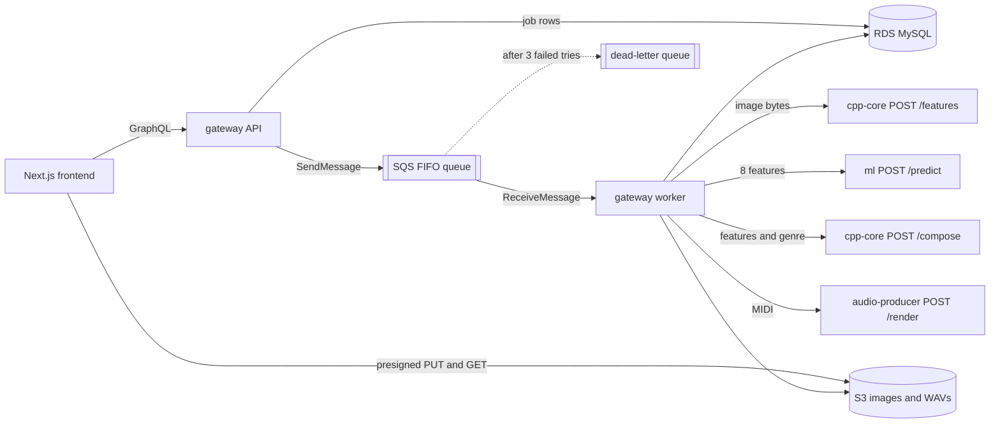

# SoundCanvas

SoundCanvas turns a picture into an original instrumental song. It measures the
image's color, brightness and contrast, picks a genre with a TensorFlow model,
composes a MIDI arrangement in C++, and renders and masters it to a WAV in Python.

It runs as four microservices on AWS: ECS Fargate, S3, SQS FIFO and RDS MySQL,
all defined in Terraform.

## Architecture



Only the gateway touches AWS. The other three services are stateless: bytes in, result out.

## How a song gets made

1. **Create.** The browser calls `createGeneration(genre)`. The API adds a
   `generations` row with status `PENDING` and returns a job id and a presigned S3 upload URL.
2. **Upload.** The browser PUTs the image straight to S3, so image bytes never pass through the API.
3. **Queue.** `startGeneration(jobId)` sets the status to `QUEUED` and sends `{ jobId }` to SQS.
4. **Process.** The worker receives the message and sets `PROCESSING`. It then:
   - downloads the image from S3
   - gets the image's 8 features from cpp-core (`/features`)
   - asks ml for a genre (`/predict`), unless the user already picked one
   - composes the song as MIDI in cpp-core (`/compose`)
   - renders and masters it to WAV in audio-producer (`/render`)
   - uploads the WAV to S3 and sets `COMPLETED`

   If any step fails, the worker sets `FAILED` with the error message.
5. **Play.** The browser polls `generation(jobId)`. Once the job is complete, the
   response includes a presigned download URL for the WAV.

The queue is **strict FIFO**. Every message shares one group, so jobs run in
the order they were started. The job id is the deduplication id, so starting a
job twice queues it once. If the worker crashes mid-job, the message reappears
after the 10-minute visibility timeout. After 3 tries it moves to the
dead-letter queue.

## The four services

| Service | Language | What it does |
| --- | --- | --- |
| `gateway/` | TypeScript | `api.ts`: the GraphQL API (Apollo). `worker.ts`: the SQS job loop. One image, run as two containers. |
| `cpp-core/` | C++17 | `POST /features` measures an image; `POST /compose` writes a MIDI song for given features and genre. |
| `ml/` | Python, TensorFlow | `POST /predict` returns a genre and confidence from the 8 features. |
| `audio-producer/` | Python | `POST /render` plays the MIDI with FluidSynth, synthesizes drums and FX, then mixes and masters it with ffmpeg. |

The **8 image features**, in order: average red, green and blue, brightness,
hue, saturation, colorfulness and contrast. Each is scaled 0 to 1. The C++
version (`cpp-core/src/ImageFeatures.cpp`) serves requests. The Python copy
(`ml/features.py`) builds the training data, and the two must match.

**Composition** (`cpp-core/src/Composer.cpp`): each genre is a template in
`GenreTemplate.cpp` with a tempo range, scale, chord progression, song sections,
16-step drum and bass patterns, and General MIDI instruments. The music theory
numbers, such as scale intervals and drum note numbers, live in
`MusicTheory.hpp`, each with a note on where it comes from.

The image then shapes the template:
- Brighter images play faster, within the genre's range.
- Warmer images use a higher key.
- More energetic images make the drops louder.

## AWS resources (`infra/terraform/`)

| File | Resources | Why |
| --- | --- | --- |
| `network.tf` | VPC, 2 public + 2 private subnets, NAT gateway, ALB, security groups | Only the load balancer is public. Containers and the database sit in private subnets. |
| `storage.tf` | S3 bucket with CORS, RDS MySQL | S3 holds the image and WAV files. RDS holds the `generations` table with each job's status. |
| `queue.tf` | SQS FIFO queue plus dead-letter queue | Hands jobs from the API to the worker in order. |
| `ecs.tf` | ECR repositories, ECS cluster, 5 Fargate services, Cloud Map | Runs the containers. The worker finds `cpp-core.soundcanvas.local` and the other services by name. |
| `iam.tf` | Execution role, API role, worker role | Each container gets only the permissions its code uses. cpp-core, ml and audio-producer get none. |

Deploy:

```sh
cd infra/terraform
cp terraform.tfvars.example terraform.tfvars   # set bucket name, frontend URL, certificate
terraform init && terraform apply
# Build and push each image to the ECR repositories printed by `terraform output`,
# then set the frontend's NEXT_PUBLIC_GRAPHQL_ENDPOINT to the api_url output.
```

To run everything locally instead, use `docker compose up --build` in
`infra/`. LocalStack stands in for S3 and SQS, and a MySQL container stands in for RDS.

## The genre model (`ml/`)

The model learns the genre rules in `ml/labeler.py`, a set of if-statements on
the image features, so the service can serve a small neural network in place
of hand-written rules.

1. `build_dataset.py` computes the features of 3,000 images in
   `ml/data/raw_images/` and labels each with the rules. It shuffles them with a
   fixed seed and splits them into **70% training, 10% validation and 20% test**.
2. `train.py` trains a Keras classifier: 8 inputs, normalization, two hidden
   layers of 64 units, and a 5-way softmax. The model size and epoch count were
   chosen on the validation split only.
3. `evaluate.py` runs the model once on the 600 held-out test images and
   prints the accuracy, the accuracy per genre, and a confusion matrix.

```sh
cd ml
pip install -r requirements.txt
python build_dataset.py && python train.py && python evaluate.py
```

**Result: 89.7% top-1 accuracy on the test split.** This measures how often
the model agrees with the rule-based labels, not a human judgment of the right
genre. Per genre: EDM Chill 85.6%, EDM Drop 77.8%, Retrowave 89.9%, Cinematic
94.2%, House 92.5%. EDM Drop has the fewest examples (45 test images) and
scores lowest.

## Repository layout

```text
frontend/        Next.js app: Playground, Examples, History
gateway/         GraphQL API + SQS worker (TypeScript)
cpp-core/        image features + MIDI composer (C++17)
ml/              genre classifier: dataset, training, evaluation, FastAPI service
audio-producer/  MIDI -> mastered WAV (FluidSynth, numpy, ffmpeg)
infra/           Terraform for AWS, docker-compose for local runs
```
