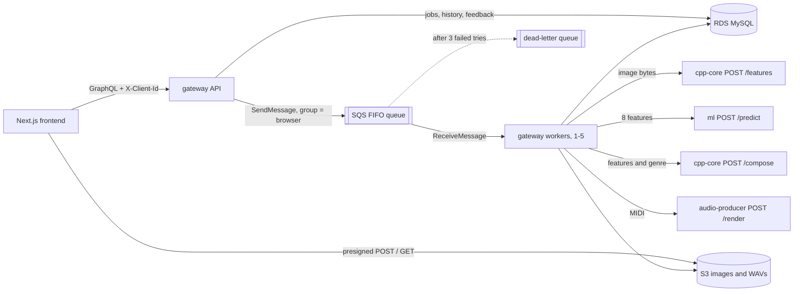

# SoundCanvas

SoundCanvas turns a picture into an original instrumental song. It measures the
image's color, brightness and contrast, picks a genre with a TensorFlow model,
composes a MIDI arrangement in C++, and renders and masters it to a WAV in Python.

A GraphQL API (Node.js) orchestrates Dockerized C++ and Python microservices on
AWS ECS Fargate, with S3, SQS FIFO and RDS MySQL, all provisioned with Terraform.

## Architecture



Only the gateway touches AWS. The other three services are stateless: bytes in, result out.

## How a song gets made

1. **Create.** The browser calls `createGeneration(genre, imageType)`. The API
   checks the rate limit, adds a `generations` row with status `PENDING`, and
   returns a job id plus a presigned S3 POST form.
2. **Upload.** The browser POSTs the image straight to S3. The form's signed
   policy only accepts that one key, the declared type (JPEG or PNG) and 1 byte
   to 10 MB, so S3 itself rejects anything else. Image bytes never pass through the API.
3. **Queue.** `startGeneration(jobId)` checks that the image arrived, sets
   `QUEUED` and sends `{ jobId }` to SQS. If the send fails, the row goes back to
   `PENDING` so the user can retry.
4. **Process.** A worker receives the message and sets `PROCESSING`, then:
   - downloads the image from S3
   - gets the image's 8 features from cpp-core (`/features`)
   - asks ml for a genre (`/predict`), unless the user already picked one
   - composes the song as MIDI in cpp-core (`/compose`)
   - renders and masters it to WAV in audio-producer (`/render`)
   - uploads the WAV to S3 and sets `COMPLETED`, saving the genre, confidence and features
5. **Play.** The browser polls `generation(jobId)`. Once complete, the response
   includes a presigned download link for the WAV. The user can rate it with a
   thumbs up or down (`rateGeneration`), and the History tab lists past songs
   (`myGenerations`), each time with fresh links.

## Design decisions

**Why a queue and a separate worker, not a direct call.** A song takes about a
minute. Holding an HTTP request open that long is fragile, so the API only
records and queues the job and returns immediately. SQS then gives us retries,
a buffer for bursts, and a queue depth to scale workers on.

**Why FIFO, grouped per browser.** Each message's group id is the browser's
client id. SQS delivers one group's messages in order, one at a time, while
different groups run in parallel on different workers. So one user's songs
finish in the order they asked, and one busy user cannot block everyone else.
The job id is the deduplication id, so starting a job twice queues it once.

**Why RDS MySQL.** The data is relational and the queries are SQL-shaped:

| Need | How MySQL does it |
| --- | --- |
| A browser's history, newest first | `WHERE client_id = ? ORDER BY created_at DESC`, on index `history_lookup` |
| Rate limit: songs in the last hour | `COUNT(*) ... WHERE (client_id = ? OR client_ip = ?) AND created_at > NOW() - INTERVAL 1 HOUR`, on indexes |
| Status changes that are safe under retries | Conditional updates, e.g. `UPDATE ... SET status='QUEUED' WHERE id=? AND status='PENDING'`, which report whether they applied |
| Data to retrain the model | Each row keeps the image's features, the predicted genre and confidence, and the user's thumbs up/down, ready for analysis in SQL |

DynamoDB could store the jobs too, but the time-ordered history, rate-limit
counts and ad-hoc analysis of features against feedback are simpler in SQL.
The trade-off is an always-on database instance, sized at the smallest class (`db.t4g.micro`).

**Why presigned S3 links.** Large files go straight between the browser and
S3, so the API never buffers images or audio. Links expire after 15 minutes.

**Why these languages.** The worker and API are TypeScript because Apollo
GraphQL and the AWS SDK are first-class in Node. Feature extraction and
composition are C++: one tight loop over every pixel, and byte-level MIDI
writing. The genre model is Python because TensorFlow is. Audio uses Python's
numpy/scipy for synthesis and FluidSynth/ffmpeg for rendering. Each service
scales on its own in ECS.

**Why GraphQL.** One typed endpoint; the schema (`gateway/src/schema.ts`)
documents every call the frontend can make, and each screen asks for exactly
the fields it shows.

## Failures and retries (`gateway/src/pipeline.ts`)

| What went wrong | What the worker does |
| --- | --- |
| Bad input: a service answers 4xx (e.g. an image that cannot be decoded, an unknown genre) | Marks the job `FAILED` and deletes the message. Retrying cannot help. |
| Temporary: a 5xx, a timeout (2 minutes per call) or a network error | Makes the message visible again in 30 seconds for another attempt. |
| The 3rd attempt fails | Marks the job `FAILED` and releases the message; SQS moves it to the dead-letter queue for inspection. |
| The worker crashes | The message reappears after the 10-minute visibility timeout (longer than 4 calls x 2 minutes) and another worker retries it. |
| The same message arrives twice | `startProcessing` only succeeds from `QUEUED` or `PROCESSING`, so a job that already finished is not redone. |

cpp-core and audio-producer return 400 for bad input and 500 for their own
bugs, which is what lets the worker tell the two apart.

## Security

- **Uploads:** the presigned POST policy restricts each upload to its own key,
  JPEG or PNG, and at most 10 MB. The frontend checks the same limits first
  for a friendlier error.
- **CORS:** the API and the S3 bucket only accept browser requests from the
  frontend's origin (`FRONTEND_ORIGIN`).
- **Rate limit:** 10 songs per hour per browser id *or* IP address, so clearing
  localStorage does not reset it. (People behind one shared IP share the limit.)
- **Scoping:** every query and mutation only sees rows with the caller's client
  id; another browser's job looks like "not found".
- **Network:** only the load balancer is public. Containers and the database are
  in private subnets. Each ECS task role has only the AWS permissions its code
  uses; cpp-core, ml and audio-producer have none.
- **Secrets:** RDS generates the database password and keeps it in Secrets
  Manager; ECS injects it into the gateway containers at start-up. It is never
  in the code, the image or the Terraform state.
- **Limitation:** the client id is anonymous, not a login. Anyone who copies a
  browser's id can see its songs. Real accounts (e.g. Cognito) would fix that.

## Tests

| Where | What | Run |
| --- | --- | --- |
| `gateway/test/` | The worker's decisions: success, bad input, retry, final attempt, duplicate delivery, missing job (AWS and services mocked) | `cd gateway && npm test` |
| `cpp-core/tests/` | Features match Python, bad bytes rejected, genre templates well formed, tempo follows brightness, MIDI files parse back correctly for every genre | `cmake -B build -DSOUNDCANVAS_TESTS=ON && cmake --build build && ctest --test-dir build` |
| `ml/tests/` | Python features match the golden file, every genre reachable by the rules, genre names identical across all four services | `python -m unittest discover -s ml/tests` |
| `tests/feature_parity/` | `golden.json`: the features Python computes for 9 test images. C++ must match within 0.01; it currently differs by at most 0.003. | `python tests/feature_parity/make_golden.py` to regenerate |

GitHub Actions (`.github/workflows/ci.yml`) runs all of these, plus the
frontend lint and type-check and `terraform validate`, on every push.

## The four services

| Service | Language | What it does |
| --- | --- | --- |
| `gateway/` | TypeScript | `api.ts`: the GraphQL API (Apollo on Express). `worker.ts`: the SQS job loop. One image, run as two ECS services. |
| `cpp-core/` | C++17 | `POST /features` measures an image; `POST /compose` writes a MIDI song for given features and genre. |
| `ml/` | Python, TensorFlow | `POST /predict` returns a genre and confidence from the 8 features. |
| `audio-producer/` | Python | `POST /render` plays the MIDI with FluidSynth, synthesizes drums and FX, then mixes and masters it with ffmpeg. |

The **8 image features**, in order: average red, green and blue, brightness,
hue, saturation, colorfulness and contrast. Each is scaled 0 to 1 (contrast 0
to 0.5). The C++ version (`cpp-core/src/ImageFeatures.cpp`) serves requests.
The Python copy (`ml/features.py`) builds the training data; the parity test
keeps them in step.

**Composition** (`cpp-core/src/Composer.cpp`): each genre is a template in
`GenreTemplate.cpp` with a tempo range, scale, chord progression, song sections,
16-step drum and bass patterns, and General MIDI instruments. The music theory
numbers, such as scale intervals and drum note numbers, live in
`MusicTheory.hpp`, each with a note on where it comes from.

The image then shapes the template:
- Brighter images play faster, within the genre's range.
- Warmer images use a higher key.
- More energetic images make the drops louder.

## AWS resources (`infra/terraform/`)

| File | Resources | Why |
| --- | --- | --- |
| `network.tf` | VPC, 2 public + 2 private subnets, NAT gateway, ALB, security groups | Only the load balancer is public. Containers and the database sit in private subnets. |
| `storage.tf` | S3 bucket with CORS, RDS MySQL | S3 holds images and WAVs. RDS holds the `generations` table (see "Why RDS MySQL"). |
| `queue.tf` | SQS FIFO queue plus dead-letter queue | Hands jobs from the API to the workers; failed jobs end up in the dead-letter queue. |
| `ecs.tf` | ECR repositories, ECS cluster, 5 Fargate services, Cloud Map, auto scaling | Runs the containers. Workers scale 1-5 on queue depth; cpp-core, ml and audio-producer scale 1-5 on CPU. The worker finds `cpp-core.soundcanvas.local` and the others by name. |
| `iam.tf` | Execution role, API role, worker role | Each container gets only the permissions its code uses. |

Deploy:

```sh
cd infra/terraform
cp terraform.tfvars.example terraform.tfvars   # set bucket name, frontend URL, certificate
terraform init && terraform apply
# Build and push each image to the ECR repositories printed by `terraform output`,
# then set the frontend's NEXT_PUBLIC_GRAPHQL_ENDPOINT to the api_url output.
```

To run everything locally instead, use `docker compose up --build` in
`infra/`. LocalStack stands in for S3 and SQS, and a MySQL container stands in for RDS.

## The genre model (`ml/`)

The images are 3,000 photos sampled (seed 42) from the Kaggle
[Flickr8k](https://www.kaggle.com/datasets/adityajn105/flickr8k) dataset:
everyday photos of people, pets, sports, concerts, beaches and city nights,
close to what users upload. `download_images.py` fetches them. (An earlier
landscape dataset was mostly dramatic skies, so nearly everything felt cinematic.)

No public dataset says "this photo sounds like House", so training uses two
kinds of labels:

- **Rule labels** (`labeler.py`): hand-written if-statements on the features
  (e.g. dark and intense means EDM Drop). Cheap, so they label 2,700 images.
- **Human labels** (`label_images.py`): 300 other images labeled by eye in a
  small local web tool that never shows the rule label. They were labeled by
  colour and mood, not by subject (an AI agent looked at each photo and its 8
  feature values and matched it to the genre descriptions). A first attempt
  labeled by subject ("people partying means House"). The model scored at
  chance on those labels, because 8 whole-image colour statistics can't see
  subjects.

`splits.py` fixes which image goes where, with seed 42. The human set is taken
out first, so no hand-labeled image is ever trained on with a rule label:

| Set | Images | Used for |
| --- | --- | --- |
| Rule train | 1,889 | Stage 1 training |
| Rule validation | 270 | Choosing the model size and when to stop |
| Rule test | 541 | The headline accuracy (agreement with the rules) |
| Human fine-tune | 210 | Stage 2 training |
| Human validation | 30 | Deciding when stage 2 stops |
| Human test | 60 | Agreement with the eye labels |

Both sets split 70/10/20 into train, validation and test.

Pipeline:

1. `build_dataset.py` computes each image's 8 features and its label.
2. `train.py`, **stage 1** (the served model, `models/genre_classifier.keras`):
   a Keras network (normalization, ReLU hidden layers, 5-way softmax). The
   training split gets 10 nudged copies of each image (each feature moved by
   about 5% of its spread), labeled with the same rules. The rules draw sharp
   lines like "brightness below 0.30", and the extra points near real images
   show the network where those lines are. Only training data is augmented;
   validation and test are real images. Four sizes are tried (2 or 3 layers of
   64 or 128 units), each with early stopping on validation accuracy, and the
   best validation score wins.
3. `train.py`, **stage 2** (an experiment, `models/genre_classifier_human.keras`):
   the stage-1 model keeps training on the 210 human fine-tune images at a
   lower learning rate, stopping on the 30 human validation images.
4. `evaluate.py` scores both models on both test sets, and scores the rules
   themselves against the human labels.

```sh
cd ml
pip install -r requirements.txt
python download_images.py                  # optional: the images are already in data/raw_images (needs kaggle.json)
python label_images.py                     # optional: label the 300 images at http://localhost:8765
python build_dataset.py && python train.py && python evaluate.py
```

**Result: 92.2% top-1 accuracy on the 541-image rule test** (96.7% on
validation), up from 88.2% before augmentation. Per genre: EDM Chill 86.5%,
EDM Drop 96.7%, Retrowave 87.9%, Cinematic 97.8%, House 93.0%. Most remaining
mistakes are between neighbouring moods: Retrowave and EDM Chill images
guessed as Cinematic. Other ideas were tried and chosen against on validation:
bigger networks without augmentation, and encoding hue as a circle.

This measures agreement with the rules. On the 60 human test images, stage 1
scores 50% (the rules themselves score 48%). Stage 2 reaches 82% there but
drops to 54% on the rule test, and it has only 2 Retrowave examples to learn
from, so stage 1 is served.

## Repository layout

```text
frontend/        Next.js app: Playground, Examples, History
gateway/         GraphQL API + SQS worker (TypeScript)
cpp-core/        image features + MIDI composer (C++17)
ml/              genre classifier: dataset, training, evaluation, FastAPI service
audio-producer/  MIDI -> mastered WAV (FluidSynth, numpy, ffmpeg)
infra/           Terraform for AWS, docker-compose for local runs
tests/           C++/Python feature parity fixtures
```
