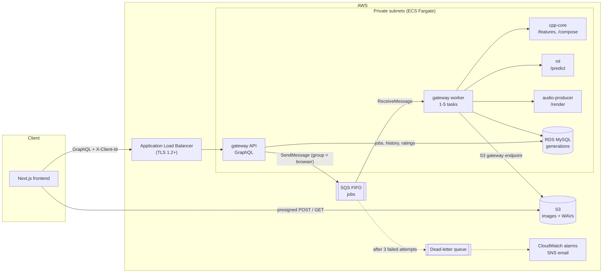

# SoundCanvas

SoundCanvas turns a picture into a short instrumental song. You upload a photo, it
measures the colours, brightness and contrast, a small TensorFlow model picks a genre,
C++ composes a MIDI arrangement, and a Python service renders and masters it to a WAV.

I built this mainly to learn AWS properly: ECS Fargate, SQS, RDS, S3, IAM and
Terraform, and how to run a few services in different languages as one system. The
music is the fun part, but most of the work is in the infrastructure and in making the
job pipeline survive crashes, retries and deploys. This README is my write-up of how
it works and why I built it the way I did.

---

## Architecture



A request goes like this. The browser calls `createGeneration` on the GraphQL API,
which checks the rate limit, writes a `PENDING` row to MySQL and returns a presigned
S3 upload form. The browser uploads the image straight to S3, then calls
`startGeneration`. The API checks that the file is really there, marks the job
`QUEUED` and sends a message to an SQS FIFO queue.

A worker picks the message up and runs the pipeline. It sends the image to cpp-core
`/features` to get 8 colour numbers, then asks ml `/predict` for a genre unless the
user already picked one. It sends both to cpp-core `/compose` to get a MIDI file, and
that goes to audio-producer `/render`, which comes back as a mastered WAV. The WAV goes
into S3 and the row becomes `COMPLETED`. Meanwhile the browser polls `generation`
every 2.5 seconds and starts playing once it gets an audio link.

The gateway (API and worker) is TypeScript with Apollo Server on Express. It is the
only part that talks to AWS. The other three services are stateless HTTP functions:
bytes or JSON in, a result out. That makes them easy to test on their own and lets
them scale independently.

- cpp-core (C++17, cpp-httplib) computes the features in one pass over the pixels and writes the MIDI.
- ml (Python, TensorFlow, FastAPI) loads the model once and serves predictions.
- audio-producer (Python, FluidSynth, numpy, ffmpeg) renders the MIDI with a General MIDI soundfont, synthesizes the drums and effects, and masters to -14 LUFS.
- RDS MySQL (`db.t4g.micro`) holds one table, `generations`: job state, history, rate-limit counts, ratings, and features for retraining.
- S3 holds uploads and finished songs, and deletes both after 30 days.

I split the services by language on purpose. Feature extraction and MIDI writing are
tight loops over pixels and bytes, so C++ made sense. The model is TensorFlow, so
Python. Rendering needs FluidSynth, ffmpeg and a 140 MB soundfont, so it gets its own
image and nothing else has to carry those. The orchestration is mostly waiting on I/O,
and Node has good GraphQL and AWS SDK support.

---

## Requirements

What it does:

- Upload a JPG or PNG (up to 10 MB) and get back a one-to-two-minute song that fits the image's mood.
- Pick one of five genres (EDM Chill, EDM Drop, Retrowave, Cinematic, House), or let the model choose.
- Watch the job's progress, then play and download the WAV.
- See your songs from the last 30 days and rate each one with a thumbs up or down.
- No sign-up. Each browser gets an anonymous id, and history, ratings and the rate limit are tied to it.

What I wanted it to hold up to:

- API calls return in milliseconds even though a song takes about a minute. The work is queued and done by workers.
- A crash, a deploy or a flaky service never silently loses a request.
- A job never gets finished twice, even if SQS delivers its message twice.
- One heavy user can't starve everyone else.
- More load means more tasks, not code changes.
- Nothing public except the load balancer, least-privilege IAM, and no stored secrets.
- Cheap when idle: one task per service, the smallest RDS class, one NAT gateway.
- Failures show up in logs and alarms, and a bad deploy rolls itself back.

---

## API

Every request carries an `X-Client-Id` header. It's a random UUID the browser makes
once and keeps in localStorage. It groups a browser's songs together but it isn't a
login.

```graphql
enum Genre     { EDM_CHILL EDM_DROP RETROWAVE CINEMATIC HOUSE }
enum Status    { PENDING QUEUED PROCESSING COMPLETED FAILED }
enum ImageType { JPEG PNG }
enum Feedback  { UP DOWN }

type Query {
  generation(jobId: ID!): Generation              # poll one job
  myGenerations(limit: Int = 20): [Generation!]!  # history, newest first (1-50)
}

type Mutation {
  createGeneration(genre: Genre, imageType: ImageType!): NewGeneration!  # step 1: job id + upload form
  startGeneration(jobId: ID!): Generation!                                # step 2: after the S3 upload
  rateGeneration(jobId: ID!, feedback: Feedback!): Generation!            # thumbs up or down
}

type Generation {
  id: ID!  status: Status!  genre: Genre  confidence: Float  feedback: Feedback
  imageUrl: String!  audioUrl: String  errorMessage: String  createdAt: String!
}

type NewGeneration { jobId: ID!  upload: ImageUpload! }
type ImageUpload   { url: String!  fields: [FormField!]! }  # a presigned S3 POST form
type FormField     { name: String!  value: String! }
```

Creating a song takes two calls because the image has to be in S3 before a worker
goes looking for it. The upload form from `createGeneration` is a presigned POST whose
policy only allows that one key, the declared content type, and 1 byte to 10 MB, so
S3 rejects anything else by itself. `startGeneration` checks the object exists and then
queues the job. If the SQS send fails, the job goes back to `PENDING` and the user can
just press start again.

Errors come back in `extensions.code`. `BAD_REQUEST` covers things like starting
before uploading or starting twice. `NOT_FOUND` is also what you get for another
browser's job, so ids can't be probed. `RATE_LIMITED` is for the song limit. Anything
unexpected, like a database or S3 failure, gets logged by an Apollo plugin, so every
5xx alarm has a log line to go with it.

Inside the VPC the worker finds the services by name through Cloud Map
(`cpp-core.soundcanvas.local`) and calls them over plain HTTP:

| Call | Request | Response |
| --- | --- | --- |
| `cpp-core POST /features` | image bytes | `{ "features": [8 numbers, 0-1] }` |
| `ml POST /predict` | `{ "features": [...] }` | `{ "genre": "HOUSE", "confidence": 0.91 }` |
| `cpp-core POST /compose` | `{ "features": [...], "genre": "HOUSE" }` | `audio/midi` |
| `audio-producer POST /render?genre=HOUSE` | MIDI bytes | `audio/wav` |

All three services return 4xx for bad input (an image that won't decode, a feature out
of range, an unknown genre, a corrupt MIDI file) and 5xx for their own failures. The
worker depends on that: a 4xx fails the job right away, a 5xx gets retried. The worker
also checks the shape of every response, so a service returning nonsense fails loudly
instead of passing bad data down the line.

---

## Data model

There's one MySQL table, `generations`, with a row per song
(`gateway/migrations/001_create_generations.sql`). The id is a UUID that doubles as
the S3 key and the SQS deduplication id. Besides the status, the row keeps the browser
id and IP (for the rate limit), the requested genre (`NULL` means let the model pick),
the genre actually used and the model's confidence, the 8 features as JSON, the thumbs
up or down, and an error message to show the user if it failed.

The indexes follow the queries:

- `history_lookup (client_id, created_at)` for a browser's history, newest first, last 30 days, excluding `PENDING`.
- `rate_limit_lookup (client_ip, created_at)` together with `history_lookup` for "songs in the last hour from this browser *or* this IP".
- `stale_jobs (status, updated_at)` for the sweeper that looks for jobs stuck in `QUEUED` or `PROCESSING` for over 60 minutes.

Status changes are compare-and-set, for example
`UPDATE ... SET status = 'QUEUED' WHERE id = ? AND status = 'PENDING'`, and the code
checks that exactly one row changed. That's what makes duplicate deliveries and double
clicks harmless.

I went with MySQL over DynamoDB because the queries are relational: a time-ordered
history, a count over a sliding window across two keys, compare-and-set updates, and
later on ad-hoc analysis of features against ratings. DynamoDB could handle the first
three with careful key design, but the OR-count and the analysis are just easier in
SQL. The downside is paying for an always-on instance.

In S3, images live at `images/{jobId}` and songs at `audio/{jobId}.wav`. A lifecycle
rule deletes both after 30 days, and history only shows 30 days, so nothing listed has
expired.

Migrations are numbered SQL files. A one-off ECS task runs them before each deploy and
records them in `schema_migrations`. The old code is still serving while a migration
runs, so migrations can only add things (new tables, new nullable columns).

---

## Design notes

### The queue

I used SQS FIFO with the browser's client id as the message group. SQS hands out one
group's messages in order and one at a time, while different groups run in parallel
on different workers. So one person's songs finish in the order they asked for them,
and someone with ten jobs only ever occupies one worker. I got fairness for free
without writing a scheduler. The deduplication id is the job id, so pressing start
twice or a client retry only queues the job once. Workers long-poll for 20 seconds, so
an idle worker makes three requests a minute.

FIFO queues take 300 sends a second without batching. Each song is one message and
takes about a minute to render, so the queue is nowhere near being the limit.

A queue at all, instead of just calling the services from the API, was the first
decision. Holding an HTTP request open for a minute runs into load balancer timeouts
and client disconnects, and it ties up an API connection per render. With a queue the
fast part (record the job, return) is separate from the slow part (render), and I also
get retries, a buffer for bursts, and a backlog number to scale on.

### Retries and crash recovery

What happens in each failure case:

- A service answers 4xx: the job is marked `FAILED` with the reason and the message is deleted, since retrying won't help.
- A 5xx, a network error, or a call taking over 2 minutes: the message becomes visible again after 30 seconds for another try.
- The third attempt fails: the job is marked `FAILED`, SQS moves the message to the dead-letter queue (`maxReceiveCount = 3`), and an alarm emails me.
- A worker crashes mid-job: while a job runs, the worker extends the message's visibility every 60 seconds. If the worker dies the heartbeat stops, and the message comes back within 120 seconds for another worker.
- A deploy or scale-in stops a worker: ECS sends SIGTERM and waits up to 120 seconds. The worker stops taking messages, finishes the current song and exits.
- The same message arrives twice: `startProcessing` only moves a job out of `QUEUED` or `PROCESSING`, so a finished job gets skipped and its message deleted.
- A job gets lost somehow, e.g. its message expired: every 5 minutes the worker fails any job stuck for over an hour, so nobody waits forever.
- SQS or MySQL is briefly unreachable: the loop logs it, waits 5 seconds and keeps going.

At first I used a 10-minute visibility timeout. The problem is that every crash then
costs 10 minutes, and it still breaks if a job ever runs longer than that. A short
timeout with a heartbeat recovers in two minutes and never expires on a job that's
still running.

Processing is at-least-once, so re-running a job has to be safe. It overwrites the
same S3 key and applies the same conditional updates. Rendering is deterministic too
(the synthesized noise uses a fixed seed), so a retried job produces the same song.

For the orchestration I considered Step Functions, but the pipeline is five calls in a
row with one retry policy. About 120 lines of tested TypeScript was simpler to run and
reason about, and it runs locally in docker compose.

### Scaling

- Workers scale from 1 to 5 on backlog per worker (waiting messages divided by running workers) with a target of 2. A song takes about a minute, so that keeps the wait near two minutes. CPU would be the wrong signal since workers mostly wait on the services.
- cpp-core, ml and audio-producer scale from 1 to 5 on CPU with a 60% target, so extra workers don't overload them.
- New tasks show up in Cloud Map DNS automatically.
- Each gateway task has a pool of 5 database connections, so at most 30 at the current caps. A `db.t4g.micro` allows roughly 60.
- At the caps that's 5 workers at about a song a minute, so roughly 300 songs an hour.

I picked Fargate over Lambda because ml loads TensorFlow once and keeps it in memory,
and the renderer has big native dependencies. Long-running containers fit both, where
Lambda would pay a cold start and hit package-size limits.

### Security

Only the load balancer is public, and it only accepts TLS 1.2 and 1.3. Containers and
the database are in private subnets, and security groups only allow task-to-task
traffic on the three service ports. S3 traffic goes through a VPC gateway endpoint
instead of the NAT.

Uploads are locked down by the presigned POST policy (key, content type, up to 10 MB).
cpp-core reads the image header before decoding and refuses anything over 40
megapixels, so a small file claiming huge dimensions can't eat all the memory. Request
bodies are capped at 10 KB of JSON at the API, 12 MB at cpp-core and 1 MB of MIDI at
audio-producer. Files never go through the API, which is why its limit can be so small.
The GraphQL schema types every argument, cpp-core and ml reject features outside 0 to
1, and the frontend ignores unknown genres in the URL.

The rate limit is 10 songs an hour per browser id *or* IP, so clearing localStorage
doesn't reset it. The code inserts the row first and counts after. If two requests
come in at once they each see the other's row, so the limit can be undershot but never
exceeded. Every query filters on the caller's client id, and another browser's job
looks the same as a missing one.

Each ECS task role only has the permissions its code uses. cpp-core, ml and
audio-producer have none, and every container runs as a non-root user. RDS generates
the database password and keeps it in Secrets Manager. ECS injects it at start-up, and
Terraform only ever sees the ARN. CI deploys through GitHub OIDC, so there are no AWS
keys stored anywhere. In production Apollo hides stack traces and turns off
introspection, and CORS on the API and the bucket only allows the frontend's origin.

The known gap is that the client id works like a bearer token: anyone who copies it
can see that browser's songs. Real accounts (e.g. Cognito) would fix that.

### Deploys and monitoring

Deploys run from `.github/workflows/deploy.yml`, started by hand and approved in the
GitHub `production` environment. The workflow builds four images tagged with the git
SHA (ECR tags are immutable), runs the migration task, then `terraform apply` rolls
each service. If the new tasks keep failing, ECS's circuit breaker rolls back to the
last working version and the workflow fails.

The load balancer health-checks the API and ECS health-checks the internal services,
replacing tasks that stop answering. Logs are one JSON line per event with the job id
and how long each step took, so CloudWatch Logs Insights can answer "which step is
slow?". Three alarms email me through SNS: anything in the dead-letter queue, a job
waiting over 10 minutes, or 5 or more API 5xx errors in 5 minutes.

### Things I'd change with more time or money

- There's one NAT gateway. If its AZ goes down, tasks lose outbound access to ECR and SQS until it recovers (S3 is fine). A NAT per AZ is about $32 a month each. VPC endpoints for SQS and ECR would also work.
- RDS is single-AZ, so a database failure means a few minutes of downtime. `multi_az = true` fixes it for about twice the cost.
- The browser polls every 2.5 seconds while it waits. Server-sent events or GraphQL subscriptions would be better.
- A failure at the last step re-runs the whole job. Storing the features and MIDI between steps would let it resume.
- Traffic inside the VPC is plain HTTP. It never leaves the private subnets, but a service mesh with mutual TLS would encrypt it.
- The deploy role has broad rights because `terraform apply` manages everything, IAM included. The trust policy limits it to the approved environment, and narrowing the policy is the next thing I'd do.

---

## Scaling further

At 10x (about 3,000 songs an hour) the architecture holds and the changes are mostly config:

- Raise the task caps, to around 50 workers and audio-producer to match. Rendering is the heaviest step, so that's where the compute bill goes.
- Autoscale the API on requests per target. One task is enough today because each call is a few milliseconds of database and S3 work, but polling grows with the number of people waiting.
- 50 workers × 5 connections is 250, too many for a `db.t4g.micro`. A worker only needs one connection at a time, so drop its pool to 1 or 2 and go up one instance class. The queries are all indexed lookups, so CPU isn't the issue.
- Add a NAT per AZ, and VPC endpoints for SQS and ECR to take most of the traffic off the NAT.

At 100x (about 30,000 songs an hour, roughly 500 renders at once) the design has to change:

- Compute becomes the main cost. Rendering on Fargate Spot works because a lost task is just a retry. Rendering is deterministic, so caching by (image hash, genre) would serve repeat uploads from S3 without rendering again.
- Split the job into stages with separate queues and worker pools for analyse, compose and render. The renderer can then scale on its own, and a retry resumes from the last finished stage.
- Put RDS Proxy in front of MySQL to pool hundreds of connections, add a read replica for history, and archive rows older than 30 days.
- Push a "job finished" event over SSE or WebSockets instead of having thousands of people poll.
- Serve WAVs through CloudFront with signed URLs instead of straight from S3.
- The queue is still fine. SQS FIFO high-throughput mode handles thousands of messages a second across many groups, and 30,000 an hour is under 10 a second.

---

## The genre model

The model is a five-way classifier: given an image, which genre fits its mood. It
doesn't look at pixels. The input is 8 colour features: average red, green and blue,
brightness, hue, saturation, colourfulness [1] and contrast [2].

I went with hand-made features and a small network instead of a CNN because the labels
are about colour and mood, not objects. A CNN would learn what's *in* the photo, which
is the wrong thing here. The features are cheap to compute in one C++ pass, the model
has about 5,000 weights, and the same 8 numbers also drive the composition (brighter
photos play faster, warmer ones in a higher key). Training uses a Python copy of the
feature code, and a parity test keeps the two versions within 0.01 of each other.

The data is a labelled dataset of 3,000 photos, each tagged with one of the five
genres by colour and mood. I split it once, stratified 80/20, into 2,400 training
photos and 600 test photos. The test photos are only scored once, at the end.

The network is a `Normalization` layer (fitted on the training data only), ReLU hidden
layers and a 5-way softmax. It trains with Adam (learning rate 0.001), sparse
categorical cross-entropy and batch size 64. Early stopping watches held-out accuracy
with patience 20. I used accuracy instead of loss because loss can go up from
overconfidence while the top-1 predictions are still getting better.

To pick the size, I trained four candidates (2 or 3 hidden layers, 64 or 128 units)
with 5-fold stratified cross-validation on the 2,400 training photos. Every photo gets
predicted exactly once while held out, so the choice is based on 2,400 predictions
instead of one small validation set.

| Network | 5-fold accuracy | Best epoch (mean) |
| --- | --- | --- |
| 2 × 64 | 79.0% ± 1.7% | 20 |
| 3 × 64 | 78.6% ± 1.4% | 12 |
| 2 × 128 | 78.8% ± 1.5% | 18 |
| 3 × 128 | 78.6% ± 1.6% | 12 |

They're all within noise of each other, so I took the smallest, 2 × 64, and retrained
it on all 2,400 photos for 20 epochs. I kept the search small on purpose, since with
enough candidates one of them wins on the folds by luck.

On the 600 test photos the network gets **79.2%** (95% bootstrap interval 75.8% to
82.3%, from 10,000 resamples). Always guessing the most common genre gets 35.7%, and
logistic regression on the same 8 features gets 76.8%. The network's lead over
logistic regression is 2.3 points, with an interval of 0.0 to 4.7, so it's probably
real but small. Most of the accuracy comes from the features, not the network.

150 of the photos have a second, independent set of labels. The two sets agree on
74.7% of them (Cohen's kappa 0.64, "substantial" on the Landis and Koch scale [7]).
The model already matches the labels more often than that, so more tuning won't buy
much. Better features would, like colour per image region or a pretrained embedding.

Most of the mistakes are between moods that are close to each other, mostly Cinematic
and House. Opposite moods (EDM Chill and EDM Drop) never get confused. Retrowave is the
weak spot: it's only 1.6% of the photos and the model rarely predicts it. I tried class
weights with the same cross-validation. They found 9 of the 37 Retrowave training
photos instead of 1, but overall accuracy dropped from 79.0% to 74.5%, so I left them
out. Users can still pick Retrowave themselves.

Every song also stores its features, the predicted genre and the user's thumbs up or
down, which gives me a source of new labels for retraining later.

The full analysis, with per-genre precision and recall and the confusion matrix, is in
`ml/evaluate.ipynb`.

```sh
cd ml && pip install -r requirements-dev.txt
python build_dataset.py   # features and the 80/20 split -> data/dataset.csv
python train.py           # cross-validation, retrain, save models/genre_classifier.keras
# then run evaluate.ipynb top to bottom
```

---

## How the music is made

Each genre has a template in `cpp-core/src/GenreTemplate.cpp`: a tempo range [4], a
scale, a chord progression, a list of sections (intro, build, drop, break, outro),
16-step drum and bass patterns, and General MIDI instruments [5]. The composer walks
the song bar by bar and plays each pattern over the current chord. The image shapes the
template: brighter images play faster within the genre's range, warmer images use a
higher key, and more energetic images hit harder in the drops. Energy weighs
saturation the most, since it affects arousal more than brightness does [3].

audio-producer plays the pitched parts through FluidSynth with a General MIDI
soundfont. The drums are synthesized in numpy with a different kit per genre, along
with risers and impacts placed at the section markers in the MIDI. The mix ducks the
instruments on every kick (the sidechain "pumping" sound), and ffmpeg masters it with
EQ, compression, loudness normalization to -14 LUFS [6] and a limiter.

---

## Tests

- `gateway/test/` covers the resolver rules (rate limit, scoping to the caller, upload before start, start once, re-queue when SQS fails) and the worker's decisions (success, bad input, retry, last attempt to the dead-letter queue, duplicate delivery, heartbeat). AWS is mocked.
- `cpp-core/tests/` checks that features match Python, bad and oversized images get rejected, out-of-range features get rejected, the templates are well formed, tempo follows brightness, and the MIDI parses back correctly for every genre.
- `audio-producer/tests/` covers MIDI events and markers, stripping the drums, deterministic drums, effect placement, the sidechain curve, mix normalization and the `/render` 400 and 413 responses.
- `ml/tests/` checks feature parity with the golden file, that every photo is labelled, stratified splits, the dataset being in sync with the labels, the `/predict` contract and validation, and that the committed model still reproduces its reported test accuracy.
- `tests/feature_parity/` holds the golden features that both languages are checked against.

GitHub Actions (`.github/workflows/ci.yml`) runs all of these on every push, along
with the frontend lint and type check, `terraform fmt` and `terraform validate`.

---

## Running it

Locally, run `docker compose up --build` in `infra/`. LocalStack stands in for S3 and
SQS, and a MySQL container stands in for RDS.

On AWS, the first deploy has to be by hand, because the deploy workflow signs in with a
role that Terraform creates:

```sh
cd infra/terraform
cp terraform.tfvars.example terraform.tfvars   # bucket, frontend URL, certificate, GitHub repo, alarm email
terraform init
terraform apply -target=aws_ecr_repository.repo -var image_tag=bootstrap   # the image repositories first
# build and push the four images, tagged with $(git rev-parse HEAD)
terraform apply -var image_tag=$(git rev-parse HEAD)
# run the migrate task once (see deploy.yml), then point the frontend's
# NEXT_PUBLIC_GRAPHQL_ENDPOINT at the api_url output
```

After that, save the `deploy_role_arn` output and the tfvars values as variables on the
GitHub `production` environment, and deploy from the Actions tab.

## Layout

```text
frontend/        Next.js app: Playground, Examples, History
gateway/         GraphQL API, SQS worker and migrations (TypeScript)
cpp-core/        image features + MIDI composer (C++17)
ml/              genre classifier: dataset, training, evaluation notebook, FastAPI service
audio-producer/  MIDI -> mastered WAV (FluidSynth, numpy, ffmpeg)
infra/           Terraform for AWS, docker compose for local runs
tests/           C++/Python feature parity fixtures
.github/         CI on every push; a manual deploy workflow
```

---

## References

1. Hasler, D. and Süsstrunk, S. (2003). *Measuring colourfulness in natural images.* Proc. SPIE 5007. The colourfulness feature.
2. ITU-R Recommendation BT.601. Luma weights 0.299, 0.587, 0.114, used for the contrast feature.
3. Valdez, P. and Mehrabian, A. (1994). *Effects of color on emotions.* Journal of Experimental Psychology: General, 123(4). Saturation drives arousal; the basis of the energy weighting.
4. Butler, M. J. (2006). *Unlocking the Groove: Rhythm, Meter, and Musical Design in Electronic Dance Music.* Indiana University Press. Tempo ranges and four-on-the-floor patterns.
5. MIDI Manufacturers Association (1991). *General MIDI Level 1 Specification.* Instrument numbers, drum notes, channel 10 for percussion.
6. ITU-R Recommendation BS.1770. Loudness measurement (LUFS); -14 LUFS is the level Spotify and YouTube normalize to.
7. Landis, J. R. and Koch, G. G. (1977). *The measurement of observer agreement for categorical data.* Biometrics, 33(1). Reading Cohen's kappa.
