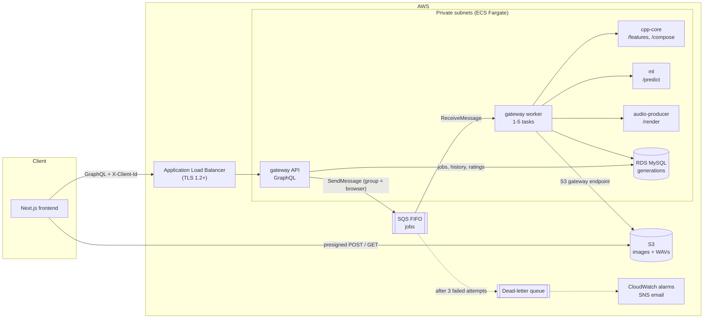

# SoundCanvas

SoundCanvas turns a picture into an original instrumental song. It measures the
image's colour, brightness and contrast, picks a genre with a TensorFlow model,
composes a MIDI arrangement in C++, and renders and masters it to a WAV in Python.

A GraphQL API (Node.js) queues each request on SQS. Workers then run it through three
stateless microservices (C++ and Python). Everything runs on AWS ECS Fargate
with S3 and RDS MySQL, provisioned with Terraform.

This document is laid out like a system design interview: requirements, the
high-level design, the API and data model, deep dives, then trade-offs and how the
design would change at 10x and 100x the load. The last part covers how the genre model was built.

---

## 1. Requirements

### Functional

1. A user uploads a JPG or PNG (up to 10 MB) and gets back a one-to-two-minute song that matches the image's mood.
2. The user can choose one of five genres (EDM Chill, EDM Drop, Retrowave, Cinematic, House), or let a model pick one from the image.
3. The user sees the job's progress, then plays and downloads the WAV.
4. The user can see their past songs (the last 30 days) and rate each one with a thumbs up or down.
5. No sign-up. Each browser gets an anonymous id, and history, rate limits and ratings are scoped to it.

### Non-functional

| Requirement | Target | How the design meets it |
| --- | --- | --- |
| Responsive API | Every API call returns in milliseconds, even though a song takes about a minute | The work is asynchronous: the API records the job and queues it, and workers do the rendering |
| No lost jobs | A crash, deploy or bad dependency never silently drops a request | SQS with at-least-once delivery, a visibility heartbeat, retries, a dead-letter queue and a stale-job sweeper |
| No duplicate work | A job is never finished twice, even when a message is delivered twice | Conditional status updates in MySQL; FIFO deduplication on the job id |
| Fairness | One heavy user cannot starve others | FIFO message groups per browser, and a rate limit of 10 songs per hour per browser or IP |
| Scalability | Throughput grows by adding tasks, with no code changes | Stateless services; workers scale on queue backlog, the internal services scale on CPU |
| Security | Least privilege, no public compute, no stored secrets | Private subnets, per-task IAM roles, presigned S3 access, Secrets Manager, GitHub OIDC |
| Low cost at rest | Small when idle | One task per service at minimum, the smallest RDS class, one NAT gateway |
| Operability | Failures are visible and deploys are safe | JSON logs per job step, CloudWatch alarms to email, immutable images, a circuit breaker with rollback |

---

## 2. High-level design



| Component | Tech | Responsibility |
| --- | --- | --- |
| Frontend | Next.js, Apollo Client | Upload, genre picker, progress, player, history, ratings |
| gateway API | TypeScript, Apollo Server on Express | Validates requests, applies the rate limit, records jobs in RDS, issues presigned S3 forms and links, queues jobs |
| gateway worker | TypeScript (same image as the API) | Takes one job at a time off SQS and runs the pipeline: features, predict, compose, render, store |
| cpp-core | C++17, cpp-httplib | `POST /features`: 8 colour features in one pass over the pixels. `POST /compose`: a MIDI song for given features and genre |
| ml | Python, TensorFlow, FastAPI | `POST /predict`: genre and confidence from the 8 features |
| audio-producer | Python, FluidSynth, numpy, ffmpeg | `POST /render`: MIDI to a mixed and mastered WAV (-14 LUFS) |
| RDS MySQL | `db.t4g.micro` | The `generations` table: job state, history, rate-limit counts, ratings and features for retraining |
| S3 | | Uploaded images and finished songs, deleted after 30 days |
| SQS FIFO + DLQ | | Buffers jobs between the API and the workers; retries; holds poison messages |

The gateway is the only component that talks to AWS. The other three services
are pure functions over HTTP (bytes or JSON in, a result out), so they are easy to test,
cache and scale.

### Why these choices

- **Asynchronous job queue, not a synchronous call.** A song takes about a minute.
  Holding an HTTP request open that long breaks on load balancer timeouts and client
  disconnects, and ties one API connection to one render. Queueing decouples the
  fast path (record, return) from the slow path (render). It also gives us retries, a buffer for
  bursts, and a backlog metric to scale on.
- **Separate microservices, by language.** Feature extraction and MIDI writing are a
  tight loop over pixels and byte-level file writing: C++. The model is TensorFlow: Python.
  Rendering needs FluidSynth, ffmpeg and a 140 MB soundfont: its own Python image. The
  orchestration is I/O-bound glue with first-class GraphQL and AWS SDKs: Node. Each
  service scales and deploys on its own, and none carries another's dependencies.
- **ECS Fargate, not Lambda.** The ml service loads TensorFlow once and keeps it in
  memory, and the renderer needs large native dependencies. Long-running containers suit
  both. Lambda would pay a cold start and hit package-size limits.
- **A worker, not Step Functions.** The pipeline is five sequential calls with one
  retry policy. About 120 lines of tested TypeScript is simpler to run and reason about
  than a state machine, and it runs locally with docker compose.
- **GraphQL.** One typed endpoint. The schema documents every operation the
  frontend can make, and each screen asks for exactly the fields it shows.
- **Presigned S3 URLs.** Images and songs go straight between the browser and S3, so
  the API never buffers large files and its request-body limit can be 10 KB.

---

## 3. API design

Every request carries `X-Client-Id`: a random UUID the browser generates once and
keeps in localStorage. It is an anonymous grouping key, not a login.

```graphql
enum Genre     { EDM_CHILL EDM_DROP RETROWAVE CINEMATIC HOUSE }
enum Status    { PENDING QUEUED PROCESSING COMPLETED FAILED }
enum ImageType { JPEG PNG }
enum Feedback  { UP DOWN }

type Query {
  generation(jobId: ID!): Generation              # poll one job
  myGenerations(limit: Int = 20): [Generation!]!  # history, newest first (1-50)
}

type Mutation {
  createGeneration(genre: Genre, imageType: ImageType!): NewGeneration!  # step 1: job id + upload form
  startGeneration(jobId: ID!): Generation!                                # step 2: after the S3 upload
  rateGeneration(jobId: ID!, feedback: Feedback!): Generation!            # thumbs up or down
}

type Generation {
  id: ID!  status: Status!  genre: Genre  confidence: Float  feedback: Feedback
  imageUrl: String!  audioUrl: String  errorMessage: String  createdAt: String!
}

type NewGeneration { jobId: ID!  upload: ImageUpload! }
type ImageUpload   { url: String!  fields: [FormField!]! }  # a presigned S3 POST form
type FormField     { name: String!  value: String! }
```

**Why two steps (create, then start).** The image must be in S3 before a worker
looks for it. `createGeneration` returns a presigned POST whose signed policy only
accepts that one key, the declared content type and 1 byte to 10 MB, so S3 itself
rejects anything else. `startGeneration` checks that the object exists, then queues the job.
If the SQS send fails, the job goes back to `PENDING` so the user can press start again.

**Errors** use `extensions.code`: `BAD_REQUEST` (e.g. starting before uploading, or
starting twice), `NOT_FOUND` (including another browser's job, so ids cannot be probed),
and `RATE_LIMITED`. Anything else (a database or S3 failure) is logged by an Apollo
plugin, so every 5xx alarm has a log line to go with it.

**Internal service contracts** (HTTP inside the VPC, found by name through Cloud Map):

| Call | Request | Response |
| --- | --- | --- |
| `cpp-core POST /features` | image bytes | `{ "features": [8 numbers, 0-1] }` |
| `ml POST /predict` | `{ "features": [...] }` | `{ "genre": "HOUSE", "confidence": 0.91 }` |
| `cpp-core POST /compose` | `{ "features": [...], "genre": "HOUSE" }` | `audio/midi` |
| `audio-producer POST /render?genre=HOUSE` | MIDI bytes | `audio/wav` |

Every service answers **4xx for bad input** (an undecodable image, a feature out of
range, an unknown genre, a corrupt MIDI file) and **5xx for its own failures**. The
worker relies on that split: a 4xx fails the job at once, a 5xx is retried. The
worker also checks the shape of each response (8 features in range, a known genre),
so a misbehaving service fails loudly instead of passing bad data down the pipeline.

---

## 4. Data model

One MySQL table, `generations`, with one row per song request
(`gateway/migrations/001_create_generations.sql`):

| Column | Type | Notes |
| --- | --- | --- |
| `id` | `CHAR(36)` PK | The job id, a UUID; also the S3 key and the SQS deduplication id |
| `client_id` | `CHAR(36)` | The browser's anonymous id |
| `client_ip` | `VARCHAR(45)` | For the rate limit; 45 characters fits any IPv6 address |
| `status` | `ENUM` | `PENDING -> QUEUED -> PROCESSING -> COMPLETED` or `FAILED` |
| `requested_genre` | `VARCHAR(20)` | The user's pick; `NULL` lets the model choose |
| `genre`, `confidence` | `VARCHAR(20)`, `FLOAT` | The genre used, and the model's confidence (`NULL` if the user picked) |
| `features` | `JSON` | The image's 8 features, kept for retraining |
| `feedback` | `ENUM('UP','DOWN')` | The user's rating |
| `error_message` | `TEXT` | Why a job failed, shown to the user |
| `created_at`, `updated_at` | `TIMESTAMP` | |

| Access pattern | Query | Index |
| --- | --- | --- |
| A browser's history, newest first | `WHERE client_id = ? AND status <> 'PENDING' AND created_at > NOW() - 30 days ORDER BY created_at DESC` | `history_lookup (client_id, created_at)` |
| Rate limit: songs in the last hour | `COUNT(*) WHERE (client_id = ? OR client_ip = ?) AND created_at > NOW() - 1 hour` | `history_lookup`, `rate_limit_lookup (client_ip, created_at)` |
| Safe state changes | `UPDATE ... SET status = 'QUEUED' WHERE id = ? AND status = 'PENDING'`, checking that one row changed | primary key |
| Sweep for lost jobs | `WHERE status IN ('QUEUED','PROCESSING') AND updated_at < NOW() - 60 min` | `stale_jobs (status, updated_at)` |

**Why MySQL rather than DynamoDB.** The access patterns are relational: a
time-ordered history, a count over a sliding window across two keys (browser *or* IP),
compare-and-set status updates, and ad-hoc analysis of features against ratings for
retraining. DynamoDB could do the first three with careful key design, but the analysis
and the OR-count are natural in SQL. The cost is an always-on instance.

**S3 layout.** `images/{jobId}` and `audio/{jobId}.wav`. A lifecycle rule deletes both
after 30 days, and history shows the same window, so nothing listed has expired.

Migrations are numbered SQL files applied by a one-off ECS task before each deploy
and recorded in `schema_migrations`. The old code is still serving while one runs, so
migrations only add (new tables, new nullable columns).

---

## 5. Deep dives

### 5.1 The queue: SQS FIFO, grouped per browser

- **Message group = client id.** SQS delivers one group's messages in order, one at a
  time, while different groups run in parallel on different workers. One user's songs
  finish in the order they were requested, and one user with ten jobs occupies at most
  one worker. That fairness is built in, with no scheduler to write.
- **Deduplication id = job id.** Pressing start twice, or a client retry, queues the job once.
- **Long polling (20 s).** Idle workers make three requests a minute instead of spinning.
- **Throughput headroom.** FIFO queues accept 300 sends per second without batching.
  Each song is one message and takes about a minute to render, so the queue is
  thousands of times away from being the limit.

### 5.2 Retries, the dead-letter queue and crash recovery

| Failure | What happens |
| --- | --- |
| Bad input: a service answers 4xx | The job is marked `FAILED` with the reason, and the message deleted. Retrying cannot help. |
| Temporary: a 5xx, a 2-minute timeout, a network error | The message is made visible again after 30 s for another attempt. |
| The 3rd attempt fails | The job is marked `FAILED`. SQS moves the message to the dead-letter queue (`maxReceiveCount = 3`), and an alarm emails us. |
| A worker crashes mid-job | While a job runs, the worker extends the message's visibility every 60 s (a heartbeat). If the worker dies, the heartbeat stops and the message reappears within 120 s for another worker. |
| A deploy or scale-in stops a worker | ECS sends SIGTERM and waits up to 120 s. The worker takes no new messages, finishes the current song and exits. |
| The same message is delivered twice | `startProcessing` only moves a job out of `QUEUED`/`PROCESSING`, so a finished job is skipped and its message deleted. |
| A job is lost (e.g. its message expired) | Every 5 minutes the worker fails jobs stuck for over an hour, so no user waits forever. |
| SQS or MySQL is briefly unreachable | The loop logs the error, backs off 5 s and carries on instead of crashing. |

**Why a heartbeat rather than a long visibility timeout.** A long fixed timeout
(this project first used 10 minutes) makes every crash cost that long, and still breaks
if a job ever runs longer. A short timeout plus a heartbeat recovers within two minutes
and never expires on a live job.

Processing is **at-least-once with idempotent effects**: re-running a job overwrites
the same S3 key and applies the same conditional updates. Rendering is deterministic
(the synthesized noise uses a fixed seed), so a retried job produces the same song.

### 5.3 Scaling

- **Workers** scale from 1 to 5 on *backlog per worker*: waiting messages divided by running
  workers, with a target of 2. A song takes about a minute, so this keeps the wait near two minutes.
  CPU would be the wrong signal, because a worker spends most of its time waiting on the services.
- **cpp-core, ml and audio-producer** scale from 1 to 5 on CPU (target 60%), so extra workers do
  not overload them. Each is stateless, so any task can serve any request.
- **Service discovery** is Cloud Map DNS (`cpp-core.soundcanvas.local`), so new tasks
  join without configuration.
- **The database** uses a pool of 5 connections per gateway task. At the current caps
  that is at most 30, well under the roughly 60 that a `db.t4g.micro` allows.
- **Current capacity:** 5 workers × about 1 song a minute ≈ **300 songs an hour** at the caps.

### 5.4 Security

- **Network:** only the load balancer is public, and it accepts TLS 1.2 and 1.3 only. Containers and the database sit in
  private subnets. Security groups allow task-to-task traffic only on the three service ports.
  S3 traffic uses a VPC gateway endpoint and never crosses the NAT.
- **Uploads:** the presigned POST policy pins the key, the content type and the size
  (up to 10 MB). cpp-core reads an image's header before decoding it and refuses anything over 40
  megapixels, so a small file claiming huge dimensions cannot exhaust memory. Request
  bodies are capped: 10 KB of JSON at the API, 12 MB at cpp-core, 1 MB of MIDI at audio-producer.
- **Input validation at every boundary:** the GraphQL schema types every argument. cpp-core and
  ml reject features outside 0-1, and the frontend ignores unknown genres in its URL.
- **Abuse:** 10 songs per hour per browser id *or* IP, so clearing localStorage
  does not reset the limit. The row is inserted *before* counting: two concurrent
  requests each see the other's row, so the limit can be undershot but never exceeded.
- **Isolation:** every query filters on the caller's client id, and another browser's job
  is indistinguishable from a missing one.
- **Least privilege:** each ECS task role has only the permissions its code uses. cpp-core, ml and
  audio-producer have none. Every container runs as a non-root user.
- **Secrets:** RDS generates the database password and keeps it in Secrets Manager;
  ECS injects it at start-up, and Terraform only sees its ARN. CI deploys through GitHub
  OIDC, so no AWS keys are stored anywhere.
- **Production mode:** Apollo hides stack traces and disables introspection. CORS on the API
  and the bucket allows only the frontend's origin.
- **Known gap:** the client id is a bearer token. Anyone who copies it can see that
  browser's songs. Real accounts (e.g. Cognito) would close this.

### 5.5 Deploys and observability

- **Deploys** (`.github/workflows/deploy.yml`, run by hand and approved in the GitHub
  `production` environment): build four images tagged with the git SHA (ECR tags are immutable),
  run the migration task, then `terraform apply` rolls each service. If new tasks keep failing,
  ECS's circuit breaker rolls back to the last working version.
- **Health checks:** the load balancer checks the API's `/health`, and ECS checks every internal
  service and replaces tasks that stop answering.
- **Logs:** one JSON line per event, with the job id and the milliseconds each step took, so
  CloudWatch Logs Insights can answer questions like "which step is slow?".
- **Alarms** (emailed through SNS): any message in the dead-letter queue, a job waiting over
  10 minutes, or 5 or more API 5xx errors in 5 minutes.

---

## 6. Trade-offs and bottlenecks

### Deliberate trade-offs at the current scale

| Choice | What it costs | What we would do instead |
| --- | --- | --- |
| One NAT gateway | If its AZ fails, tasks lose outbound access (ECR, SQS) until it recovers; S3 is unaffected | A NAT per AZ, or VPC endpoints for SQS and ECR |
| Single-AZ RDS | A database failure is a few minutes of downtime | `multi_az = true` |
| The browser polls every 2.5 s | Steady requests while a user waits | Server-sent events or GraphQL subscriptions |
| One HTTP chain per job | A failure at the last step re-runs the job from the start | Store intermediate results (features, MIDI) and resume |
| Plain HTTP inside the VPC | Unencrypted, but never leaves the private subnets | A service mesh with mutual TLS |
| Anonymous client id | No real accounts | Cognito sign-in |
| Terraform applies with broad rights from CI | A compromised workflow could change anything | The trust policy limits it to the approved environment; a narrower policy is next |

### At 10x (about 3,000 songs an hour)

The architecture holds. The changes are all configuration:

1. **Raise the task caps.** Workers to about 50, audio-producer to match. Rendering is
   the most CPU-heavy step, so audio-producer is where the compute bill goes.
2. **Autoscale the API** on load balancer requests per target. It is one task today
   because each call is a few milliseconds of database and S3 work, but polling grows
   with the number of waiting users.
3. **Database connections.** 50 workers × 5 connections is 250, beyond a `db.t4g.micro`. A worker
   only needs one connection at a time, so lower its pool to 1 or 2 and move up one
   instance class. The queries are all indexed point lookups or small ranges, so CPU is not the issue.
4. **NAT per AZ.** More tasks make the single NAT both a bigger blast radius and a
   bigger data-processing bill. Adding VPC endpoints for SQS and ECR removes most of that traffic.

### At 100x (about 30,000 songs an hour, roughly 500 renders running at once)

The design changes, not just the numbers:

1. **Compute cost dominates.** Render on Fargate Spot (a lost task is just a retry,
   thanks to the heartbeat) and cache results: rendering is deterministic, so the key
   *(image hash, genre)* can serve a repeat upload from S3 without rendering it again.
2. **Break the job into stages.** Separate queues for analyse, compose and render, each with
   its own worker pool, so the expensive renderer scales on its own and a retry
   resumes from the last finished stage.
3. **Database.** RDS Proxy in front of MySQL to pool hundreds of task connections; a read replica
   for history if polling moves off the primary; partition or archive rows older than 30 days.
4. **Push instead of poll.** SSE or WebSockets fan out a "job finished" event, so thousands
   of waiting users are not polling the API.
5. **Delivery.** Serve finished WAVs through CloudFront with signed URLs, rather than straight from S3.
6. **The queue is still fine.** SQS FIFO high-throughput mode supports thousands of messages per
   second across many message groups; 30,000 an hour is under 10 a second.

---

## 7. ML methodology

### Problem framing

Five-way classification: given an image, predict which of the five genres fits its mood.
The inputs are **8 hand-built colour features** (average red, green and blue,
brightness, hue, saturation, colourfulness [1], contrast [2]), not raw pixels.

**Why features and a small network rather than a CNN.** The labels describe colour and
mood, not objects, so colour statistics carry the signal. A CNN would learn what is
*in* the photo, which is the wrong cue. The features are computed in a single C++ pass
while serving, and the model has about 5,000 weights, so a prediction is cheap. The
features are also interpretable (brighter photos play faster, warmer ones in a higher key), so the
same 8 numbers drive both the genre choice and the composition. A Python copy of the
feature code builds the training data, and a parity test keeps it within 0.01 of the C++ version.

### Data

A labelled dataset of 3,000 photos, each tagged with one of the five genres by its
colour and mood. It is split once, **stratified 80/20**: 2,400 training photos and 600 test photos,
with each genre split in the same proportion. The test photos are scored once, at
the end, and never used to make a choice.

### Model and training

- `Normalization` (mean 0, variance 1, fitted on training data only) → ReLU hidden layers → 5-way softmax.
- Adam (learning rate 0.001), sparse categorical cross-entropy, batch size 64.
- Early stopping on held-out accuracy (patience 20). Accuracy rather than loss, because loss can
  rise from overconfidence while the top-1 choices are still improving.

### Model selection: 5-fold stratified cross-validation

Four sizes (2 or 3 hidden layers × 64 or 128 units) are each trained five times, each time
holding out a different fifth of the 2,400 training photos. Every photo is scored exactly once,
so the choice rests on 2,400 predictions rather than a single small validation set, and the
spread across folds shows how stable each score is.

| Network | 5-fold accuracy | Best epoch (mean) |
| --- | --- | --- |
| **2 × 64** | **79.0% ± 1.7%** | 20 |
| 3 × 64 | 78.6% ± 1.4% | 12 |
| 2 × 128 | 78.8% ± 1.5% | 18 |
| 3 × 128 | 78.6% ± 1.6% | 12 |

The sizes are within noise of each other, so the smallest one wins. It is then
retrained on all 2,400 photos for the mean best epoch count (20) and saved.
The search is kept small on purpose: with more candidates, the search starts fitting the folds.

### Evaluation (600 held-out photos)

| Model | Test accuracy |
| --- | --- |
| Always the most common genre | 35.7% |
| Logistic regression, same 8 features | 76.8% |
| **Neural network (served)** | **79.2%** (95% bootstrap interval 75.8% to 82.3%) |

The intervals come from resampling the 600 test photos 10,000 times. The network's lead over
logistic regression is 2.3 points (interval 0.0 to 4.7): probably real, but small. The honest
reading is that **the features, not the model, set the ceiling**.

- **Label consistency.** 150 photos were labelled a second time, independently: the two sets
  agree on 74.7% (Cohen's kappa 0.64, "substantial" [7]). The model already matches the
  labels more often than that, so more tuning buys little. Richer features (colour per image
  region, a pretrained embedding) would.
- **Errors are between neighbouring moods.** Cinematic and House are confused most often.
  Opposite moods (EDM Chill and EDM Drop) are never confused.
- **Class imbalance.** Retrowave is 1.6% of the photos and the model rarely predicts it.
  Class weights were tested under the same cross-validation: they found 9 of 37 Retrowave
  photos instead of 1, but cut accuracy from 79.0% to 74.5%. We kept overall accuracy,
  and users can still choose Retrowave themselves.
- **Closing the loop.** Every song stores its features, the predicted genre and the user's
  thumbs up or down, which is a ready-made source of new labels for retraining.

Full analysis, with per-genre precision and recall and the confusion matrix: `ml/evaluate.ipynb`.

```sh
cd ml && pip install -r requirements-dev.txt
python build_dataset.py   # features and the 80/20 split -> data/dataset.csv
python train.py           # cross-validation, retrain, save models/genre_classifier.keras
# then run evaluate.ipynb top to bottom
```

---

## 8. How the music is made

**Composition** (`cpp-core/src/Composer.cpp`): each genre is a template in
`GenreTemplate.cpp`: a tempo range [4], a scale, a chord progression, song sections
(intro, build, drop, break, outro), 16-step drum and bass patterns, and General MIDI instruments [5].
The image shapes the template: brighter images play faster within the genre's range, warmer
images use a higher key, and more energetic images hit harder in the drops. Energy weighs
saturation most, since it drives arousal more than brightness does [3].

**Rendering** (`audio-producer/`): FluidSynth plays the pitched parts with a General MIDI
soundfont. numpy synthesizes a genre-specific drum kit and the risers and impacts at each
section marker. The mix adds kick sidechain "pumping", and ffmpeg masters the result: EQ,
compression, and loudness normalization to -14 LUFS [6], then a limiter.

---

## 9. Testing and CI

| Where | What it covers |
| --- | --- |
| `gateway/test/` | Resolver rules: rate limit, scoping to the caller, upload-before-start, start-once, re-queue when SQS fails. Worker decisions: success, bad input, retry, last attempt to the dead-letter queue, duplicate delivery, heartbeat. AWS is mocked. |
| `cpp-core/tests/` | Features match Python, bad and oversized images rejected, features out of range rejected, templates well formed, tempo follows brightness, MIDI parses back correctly for every genre |
| `audio-producer/tests/` | MIDI events and markers, drum stripping, deterministic drums, FX placement, sidechain curve, mix normalization, `/render` 400/413 responses |
| `ml/tests/` | Feature parity with the golden file, labels complete, stratified splits, dataset in sync with the labels, `/predict` contract and validation, and that the committed model reproduces its reported test accuracy |
| `tests/feature_parity/` | The golden features both languages are checked against |

GitHub Actions (`.github/workflows/ci.yml`) runs all of these on every push, plus
the frontend lint and type-check, `terraform fmt` and `terraform validate`.

---

## 10. Running it

**Locally:** `docker compose up --build` in `infra/`. LocalStack stands in for S3 and SQS,
and a MySQL container for RDS.

**On AWS** (the first deploy is by hand, because Terraform creates the deploy role):

```sh
cd infra/terraform
cp terraform.tfvars.example terraform.tfvars   # bucket, frontend URL, certificate, GitHub repo, alarm email
terraform init
terraform apply -target=aws_ecr_repository.repo -var image_tag=bootstrap   # the image repositories first
# build and push the four images, tagged with $(git rev-parse HEAD)
terraform apply -var image_tag=$(git rev-parse HEAD)
# run the migrate task once (see deploy.yml), then point the frontend's
# NEXT_PUBLIC_GRAPHQL_ENDPOINT at the api_url output
```

After that, store the `deploy_role_arn` output and the tfvars values as variables of the GitHub
`production` environment, and deploy from the Actions tab.

```text
frontend/        Next.js app: Playground, Examples, History
gateway/         GraphQL API, SQS worker and migrations (TypeScript)
cpp-core/        image features + MIDI composer (C++17)
ml/              genre classifier: dataset, training, evaluation notebook, FastAPI service
audio-producer/  MIDI -> mastered WAV (FluidSynth, numpy, ffmpeg)
infra/           Terraform for AWS, docker compose for local runs
tests/           C++/Python feature parity fixtures
.github/         CI on every push; a manual deploy workflow
```

---

## References

1. Hasler, D. and Süsstrunk, S. (2003). *Measuring colourfulness in natural images.* Proc. SPIE 5007. The colourfulness feature.
2. ITU-R Recommendation BT.601. Luma weights 0.299, 0.587, 0.114, used for the contrast feature.
3. Valdez, P. and Mehrabian, A. (1994). *Effects of color on emotions.* Journal of Experimental Psychology: General, 123(4). Saturation drives arousal; the basis of the energy weighting.
4. Butler, M. J. (2006). *Unlocking the Groove: Rhythm, Meter, and Musical Design in Electronic Dance Music.* Indiana University Press. Tempo ranges and four-on-the-floor patterns.
5. MIDI Manufacturers Association (1991). *General MIDI Level 1 Specification.* Instrument numbers, drum notes, channel 10 for percussion.
6. ITU-R Recommendation BS.1770. Loudness measurement (LUFS); -14 LUFS is the level Spotify and YouTube normalize to.
7. Landis, J. R. and Koch, G. G. (1977). *The measurement of observer agreement for categorical data.* Biometrics, 33(1). Reading Cohen's kappa.
