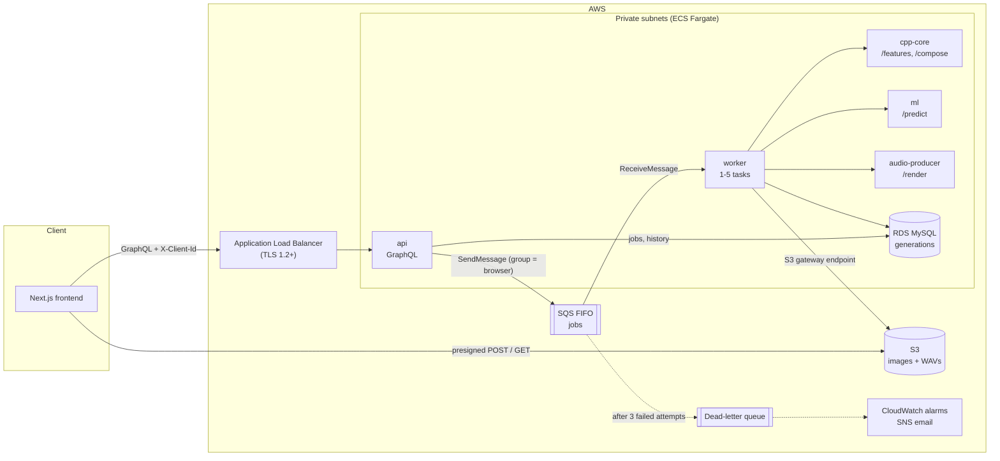

# SoundCanvas

SoundCanvas turns a photo into a short instrumental song. It measures the photo's
colours, a small TensorFlow model picks one of four genres, C++ composes a MIDI
arrangement, and a Python service renders and masters it to a WAV.

I built it mainly to learn AWS properly: ECS Fargate, SQS, RDS, S3, IAM and Terraform,
and running services written in different languages as one system. Most of the work went
into the infrastructure and into making the job pipeline survive crashes, retries and
deploys.

## Architecture



The browser calls `createGeneration` on the GraphQL API, which checks the rate limit,
writes a `PENDING` row to MySQL and returns a presigned S3 upload form. The browser
uploads the image straight to S3 and calls `startGeneration`, which checks the file is
there, marks the job `QUEUED` and sends it to an SQS FIFO queue. A worker takes the
message, gets 8 colour features from cpp-core, asks ml for a genre unless the user picked
one, gets a MIDI file from cpp-core and a mastered WAV from audio-producer, then uploads
the WAV and marks the row `COMPLETED`. The browser polls every 2.5 seconds and starts
playing as soon as there's an audio link.

## Stack

- frontend: Next.js, Apollo Client, Tailwind
- api: TypeScript, Apollo Server on Express, the SQS worker and the SQL migrations. It's the only part that talks to AWS.
- cpp-core: C++17 with cpp-httplib, nlohmann/json and stb_image, for the loops over pixels and bytes
- ml: Python, TensorFlow, FastAPI
- audio-producer: Python, FluidSynth, numpy and ffmpeg, in its own image so nothing else carries the 140 MB soundfont
- AWS: ECS Fargate, SQS FIFO, RDS MySQL, S3, Cloud Map, CloudWatch and SNS, all in Terraform and deployed by GitHub Actions with OIDC

cpp-core, ml and audio-producer are stateless HTTP services, so each one can be tested and
scaled on its own.

## Design notes

### Queue and retries

- The queue is SQS FIFO with the browser's client id as the message group. One person's songs finish in order and only ever use one worker at a time, so a heavy user can't starve everyone else.
- The generation id is the deduplication id, so a double click or a client retry only queues the job once.
- I used a queue rather than calling the services from the API because holding a request open for a minute runs into load balancer timeouts and ties up a connection per render.
- A 4xx from a service fails the job straight away, since retrying won't help. A 5xx, a network error or a call over 2 minutes is retried after 30 seconds.
- After 3 failed attempts the job is marked `FAILED`, SQS moves the message to the dead-letter queue and an alarm emails me.
- The visibility timeout is 120 seconds and the worker extends it every 60 seconds while a job runs. If a worker dies, its message is back on the queue within 2 minutes, and a slow job never expires while it's still running.
- On a deploy or scale-in, ECS sends SIGTERM and waits up to 120 seconds, so the worker finishes its current song before exiting.
- Status changes are compare-and-set (`UPDATE ... WHERE id = ? AND status = 'PENDING'`), and a duplicate delivery of a finished job is skipped.
- Every 5 minutes the worker fails any job stuck for over an hour, so nobody waits forever.
- Processing is at-least-once, so a re-run has to be safe. It writes the same S3 key, and rendering is deterministic because the synthesized noise uses a fixed seed.
- I considered Step Functions, but the pipeline is five calls in a row with one retry policy. A short TypeScript loop was simpler to test, and it runs locally in docker compose.

### Security

- Only the load balancer is public, and it only accepts TLS 1.2 and 1.3. Everything else is in private subnets, and S3 traffic goes through a VPC gateway endpoint.
- Uploads go straight to S3 with a presigned POST that only allows one key, the declared content type and up to 10 MB. cpp-core reads the image header and refuses anything over 40 megapixels before decoding.
- Request bodies are capped at 10 KB of JSON at the API, 12 MB at cpp-core and 1 MB of MIDI at audio-producer.
- The rate limit is 10 songs an hour per browser id or IP, so clearing localStorage doesn't reset it. The row is inserted before counting, so two requests at once can undershoot the limit but never exceed it.
- Each task role only has the permissions its code uses, and the three services have none. The database password lives in Secrets Manager and CI deploys through GitHub OIDC, so no AWS keys are stored anywhere.
- Every query is scoped to the caller's client id, and another browser's job looks the same as a missing one. The client id isn't a login, though: anyone who copies it can see that browser's songs. Real accounts (for example Cognito) would fix that.

### Scaling

- Workers scale from 1 to 5 on backlog per worker with a target of 2. CPU would be the wrong signal, because workers mostly wait on the services.
- cpp-core, ml and audio-producer scale from 1 to 5 on CPU at 60%, and new tasks show up in Cloud Map DNS by themselves.
- Each API and worker task has a pool of 5 database connections, so at most 30 at the current caps, against roughly 60 for a `db.t4g.micro`.
- At the caps that's about 300 songs an hour. At 10x I'd raise the caps and give each worker a database pool of one or two connections. Beyond that I'd split the job into stages with their own queues, render on Fargate Spot and put RDS Proxy in front of MySQL.
- I picked Fargate over Lambda because ml keeps TensorFlow loaded in memory and the renderer has large native dependencies.
- I picked MySQL over DynamoDB because the queries are relational: a time-ordered history, a count over a sliding window across two keys, and compare-and-set updates.

## The genre model

The model doesn't look at pixels. Its input is 8 colour features: average red, green and
blue, brightness, hue, saturation, colourfulness (Hasler and Süsstrunk 2003) and
contrast. The labels are about colour and mood rather than objects, so a CNN would learn
the wrong thing. Each of the 2,953 photos has one of the four genres as its label, and I
split them once into 2,362 for training and 591 for testing, stratified by genre. The
network is a `Normalization` layer, two ReLU layers of 64 units and a softmax. I chose
that size from four candidates with 5-fold cross-validation; they were all within noise,
so I took the smallest.

Results on the 591 test photos:

- Top-1 accuracy: 80.9% (95% bootstrap interval 77.7% to 84.1%)
- Top-2 accuracy: 95.6% (93.9% to 97.1%)
- Logistic regression on the same 8 features: 78.5%
- Always guessing the most common genre: 36.4%
- Agreement between two label sets on 149 photos: 74.5% (Cohen's kappa 0.64)

The lead over logistic regression is small (2.4 points, interval 0.0 to 4.7), so most of
the accuracy comes from the features rather than the network.

The per-genre breakdown and the confusion matrix are in `ml/evaluate.ipynb`. To rebuild
the model, run `build_dataset.py` and then `train.py` in `ml/`.

## How the music is made

Each genre has a template in `cpp-core/src/GenreTemplate.cpp`: a tempo range, a scale, a
chord progression, a list of sections, 16-step drum, bass and chord patterns, and General
MIDI instruments. The composer walks the song bar by bar and plays each pattern over the
current chord. Brighter photos play faster, warmer ones use a higher key, and more
saturated and colourful ones hit harder in the drops. Saturation weighs the most, since
it affects arousal more than brightness does (Valdez and Mehrabian 1994).

audio-producer renders the pitched parts with FluidSynth and a General MIDI soundfont. It
synthesizes the drums in numpy, with a different kit per genre, and adds risers and impacts
at the section markers. The mix ducks the instruments on every kick, and ffmpeg masters it
with EQ, compression, loudness normalization to -14 LUFS and a limiter.

## Running it

Locally, run `docker compose up --build` in `infra/`. LocalStack stands in for S3 and SQS,
and a MySQL container stands in for RDS.

On AWS, the first deploy has to be done by hand, because the deploy workflow signs in
with a role that Terraform creates:

```sh
cd infra/terraform
cp terraform.tfvars.example terraform.tfvars   # bucket, frontend URL, certificate, GitHub repo, alarm email
terraform init
terraform apply -target=aws_ecr_repository.repo -var image_tag=bootstrap
# build and push the four images, tagged with $(git rev-parse HEAD)
terraform apply -var image_tag=$(git rev-parse HEAD)
# run the migrate task once (see deploy.yml), then point the frontend's
# NEXT_PUBLIC_GRAPHQL_ENDPOINT at the api_url output
```

After that, deploys run from the Actions tab with approval in the GitHub `production`
environment. The migration task runs first, and if the new tasks keep failing, ECS rolls
back to the last working version.

## Tests

- `api/test/`: the resolver rules and the worker's retry, dead-letter, duplicate and heartbeat decisions, with AWS mocked.
- `cpp-core/tests/`: feature parity with Python, bad and oversized images, out-of-range features, the genre templates, and MIDI that parses back for every genre.
- `ml/tests/`: feature parity, the labels and the split, the `/predict` contract, and the committed model still scoring 80.9%.
- `audio-producer/tests/`: MIDI parsing, drums, effects, the sidechain, the mix and the `/render` error responses.

Both parity tests check against the golden features in `tests/feature_parity/`. GitHub
Actions runs all of these on every push, along with the frontend lint and type check,
`terraform fmt` and `terraform validate`.

## Layout

```text
frontend/        Next.js app: Playground, Examples, History
api/             GraphQL API, SQS worker and migrations
cpp-core/        image features and MIDI composer
ml/              dataset, training, evaluation notebook and the /predict service
audio-producer/  MIDI to mastered WAV
infra/           Terraform for AWS, docker compose for local runs
tests/           feature parity fixtures shared by C++ and Python
.github/         CI on every push, manual deploy workflow
```

## Things I'd change

- There's one NAT gateway, so if its availability zone goes down, tasks lose access to ECR and SQS. A NAT per zone, or VPC endpoints for SQS and ECR, would fix that.
- RDS is single-AZ. `multi_az = true` fixes that for about twice the cost.
- The browser polls while it waits. Server-sent events or GraphQL subscriptions would be better.
- A failure at the last step re-runs the whole job. Storing the features and MIDI between steps would let it resume.
- The deploy role has broad rights because `terraform apply` manages everything, IAM included. Narrowing it is the next thing I'd do.
