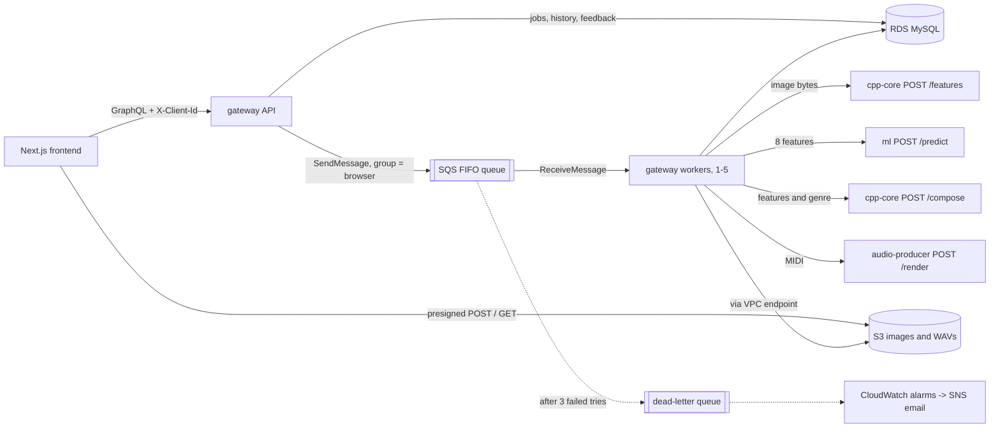

# SoundCanvas

SoundCanvas turns a picture into an original instrumental song. It measures the
image's color, brightness and contrast, picks a genre with a TensorFlow model,
composes a MIDI arrangement in C++, and renders and masters it to a WAV in Python.

A GraphQL API (Node.js) orchestrates Dockerized C++ and Python microservices on
AWS ECS Fargate, with S3, SQS FIFO and RDS MySQL, all provisioned with Terraform.

## Architecture



Only the gateway touches AWS. The other three services are stateless: bytes in, result out.

## How a song gets made

1. **Create.** The browser calls `createGeneration(genre, imageType)`. The API
   adds a `generations` row with status `PENDING`, checks the rate limit, and
   returns a job id plus a presigned S3 POST form.
2. **Upload.** The browser POSTs the image straight to S3. The form's signed
   policy only accepts that one key, the declared type (JPEG or PNG) and 1 byte
   to 10 MB, so S3 itself rejects anything else. Image bytes never pass through the API.
3. **Queue.** `startGeneration(jobId)` checks that the image arrived, sets
   `QUEUED` and sends `{ jobId }` to SQS. If the send fails, the row goes back to
   `PENDING` so the user can retry.
4. **Process.** A worker receives the message and sets `PROCESSING`, then:
   - downloads the image from S3
   - gets the image's 8 features from cpp-core (`/features`)
   - asks ml for a genre (`/predict`), unless the user already picked one
   - composes the song as MIDI in cpp-core (`/compose`)
   - renders and masters it to WAV in audio-producer (`/render`)
   - uploads the WAV to S3 and sets `COMPLETED`, saving the genre, confidence and features
5. **Play.** The browser polls `generation(jobId)`. Once complete, the response
   includes a presigned download link for the WAV. The user can rate it with a
   thumbs up or down (`rateGeneration`), and the History tab lists the last 30
   days of songs (`myGenerations`), each time with fresh links.

## Design decisions

**Why a queue and a separate worker, not a direct call.** A song takes about a
minute. Holding an HTTP request open that long is fragile, so the API only
records and queues the job and returns immediately. SQS then gives us retries,
a buffer for bursts, and a backlog to scale workers on.

**Why FIFO, grouped per browser.** Each message's group id is the browser's
client id. SQS delivers one group's messages in order, one at a time, while
different groups run in parallel on different workers. So one user's songs
finish in the order they asked, and one busy user cannot block everyone else.
The job id is the deduplication id, so starting a job twice queues it once.

**Why RDS MySQL.** The data is relational and the queries are SQL-shaped:

| Need | How MySQL does it |
| --- | --- |
| A browser's history, newest first | `WHERE client_id = ? ORDER BY created_at DESC`, on index `history_lookup` |
| Rate limit: songs in the last hour | `COUNT(*) ... WHERE (client_id = ? OR client_ip = ?) AND created_at > NOW() - INTERVAL 1 HOUR`, on indexes |
| Status changes that are safe under retries | Conditional updates, e.g. `UPDATE ... SET status='QUEUED' WHERE id=? AND status='PENDING'`, which report whether they applied |
| Data to retrain the model | Each row keeps the image's features, the predicted genre and confidence, and the user's thumbs up/down, ready for analysis in SQL |

DynamoDB could store the jobs too, but the time-ordered history, rate-limit
counts and ad-hoc analysis of features against feedback are simpler in SQL.
The trade-off is an always-on database instance, sized at the smallest class (`db.t4g.micro`).

**Why presigned S3 links.** Large files go straight between the browser and
S3, so the API never buffers images or audio. Links expire after 15 minutes.

**Why ECS Fargate, not Lambda.** Rendering needs FluidSynth, ffmpeg and a
140 MB soundfont, and the ml service loads TensorFlow once and keeps it in
memory. Long-running containers suit both; Lambda would pay a cold start and
package-size limits on every one. Step Functions could replace the worker's
five calls, but the worker is ~120 lines of TypeScript, tested, and one less
service to learn.

**Why these languages.** The worker and API are TypeScript because Apollo
GraphQL and the AWS SDK are first-class in Node. Feature extraction and
composition are C++: one tight loop over every pixel, and byte-level MIDI
writing. The genre model is Python because TensorFlow is. Audio uses Python's
numpy/scipy for synthesis and FluidSynth/ffmpeg for rendering. Each service
scales on its own in ECS.

**Why GraphQL.** One typed endpoint; the schema (`gateway/src/schema.ts`)
documents every call the frontend can make, and each screen asks for exactly
the fields it shows.

## Failures and retries (`gateway/src/pipeline.ts`, `worker.ts`)

| What went wrong | What happens |
| --- | --- |
| Bad input: a service answers 4xx (an undecodable or over-40-megapixel image, an unknown genre) | The job is marked `FAILED` and the message deleted. Retrying cannot help. |
| Temporary: a 5xx, a timeout (2 minutes per call) or a network error | The message becomes visible again in 30 seconds for another attempt. |
| The 3rd attempt fails | The job is marked `FAILED`; SQS moves the message to the dead-letter queue and an alarm emails us. |
| A worker crashes mid-job | While a job runs, the worker extends the message's visibility every minute (a heartbeat). When the worker dies the heartbeat stops, and the message reappears within 2 minutes for another worker. |
| A deploy or scale-in stops a worker | ECS sends SIGTERM and waits up to 120 seconds. The worker stops taking new messages, finishes the current song, and exits. |
| A job is stuck (e.g. its message expired) | Every 5 minutes the worker marks jobs `QUEUED` or `PROCESSING` for over an hour as `FAILED`, so no user waits forever. |
| The same message arrives twice | `startProcessing` only succeeds from `QUEUED` or `PROCESSING`, so a job that already finished is not redone. |
| The worker loop itself errors (e.g. SQS briefly unreachable) | It logs, waits 5 seconds and carries on instead of crashing the task. |

cpp-core and audio-producer return 400 for bad input and 500 for their own
bugs, which is what lets the worker tell the two apart.

## Security

- **Uploads:** the presigned POST policy restricts each upload to its own key,
  JPEG or PNG, and at most 10 MB. cpp-core reads an image's header before
  decoding it and refuses anything over 40 megapixels, so a small file that
  claims huge dimensions cannot exhaust memory. The API accepts at most 10 KB
  of JSON, and cpp-core and audio-producer cap their request bodies too.
- **CORS:** the API and the S3 bucket only accept browser requests from the
  frontend's origin (`FRONTEND_ORIGIN`).
- **Rate limit:** 10 songs per hour per browser id *or* IP address, so clearing
  localStorage does not reset it. The job row is inserted before counting, so
  two simultaneous requests cannot both slip under the limit.
- **Scoping:** every query and mutation only sees rows with the caller's client
  id; another browser's job looks like "not found".
- **Network:** only the load balancer is public, with TLS 1.2+ only. Containers
  and the database are in private subnets, and tasks accept traffic from each
  other only on the three service ports.
- **Least privilege:** each ECS task role has only the AWS permissions its code
  uses; cpp-core, ml and audio-producer have none. Every container runs as a non-root user.
- **Secrets:** RDS generates the database password and keeps it in Secrets
  Manager; ECS injects it into the gateway containers at start-up. It is never
  in the code or the image. The deploy workflow signs in to AWS with GitHub's
  OIDC token, so no AWS keys are stored in GitHub.
- **Production mode:** the gateway runs with `NODE_ENV=production`, so Apollo
  hides stack traces and turns off schema introspection.
- **Limitation:** the client id is anonymous, not a login. Anyone who copies a
  browser's id can see its songs. Real accounts (e.g. Cognito) would fix that.

## Operations

- **Deploys** (`.github/workflows/deploy.yml`, run by hand and approved in the
  GitHub `production` environment): build the four images tagged with the git
  SHA, run the database migration as a one-off ECS task, then `terraform apply`
  rolls every service onto the new images. ECR tags are immutable, so a SHA
  always names the same code. If new tasks keep failing, ECS's circuit breaker
  rolls back to the last working version and the workflow fails.
- **Migrations** (`gateway/migrations/`, applied by `npm run migrate`): numbered
  SQL files, each applied once and recorded in `schema_migrations`. The old code
  is still serving while a migration runs, so migrations only add (new tables,
  new nullable columns).
- **Alarms** (`infra/terraform/monitoring.tf`, emailed through SNS): any message
  in the dead-letter queue, a job waiting over 10 minutes, or 5+ API server
  errors in 5 minutes.
- **Health checks:** the load balancer checks the API's `/health`; ECS checks
  cpp-core, ml and audio-producer and replaces a task that stops answering.
- **Logs:** the gateway writes one JSON line per event with the job id and how
  long each step took, so CloudWatch Logs Insights can answer "which step is slow?".
- **Scaling:** workers scale 1-5 on waiting jobs per running worker (target 2);
  cpp-core, ml and audio-producer scale 1-5 on CPU.
- **Data lifetime:** uploads and songs are deleted from S3 after 30 days, and
  history shows the same window. RDS keeps 7 days of automatic backups.

## Trade-offs we chose

| Choice | Cost we accept | What we would do at scale |
| --- | --- | --- |
| One NAT gateway | If its AZ fails, tasks lose outbound access (ECR, SQS) until it recovers. S3 traffic uses the VPC endpoint and is unaffected. | A NAT per AZ, or VPC endpoints for ECR and SQS too |
| Single-AZ RDS | A database failure means a few minutes of downtime while RDS recovers | `multi_az = true` (a standby in the second AZ) |
| The browser polls for status | A request every couple of seconds per waiting user | GraphQL subscriptions or server-sent events |
| Anonymous client id | No real accounts (see Security) | Cognito sign-in |
| Plain HTTP inside the VPC | Traffic between tasks is unencrypted, but never leaves the private subnets | A service mesh with mutual TLS |
| One HTTP chain per job | A job re-runs from the start if any step fails | Store intermediate results (features, MIDI) and resume |
| Terraform applies from CI with admin rights | A compromised workflow could change anything | The trust policy limits it to the approved `production` environment; a narrower custom policy is the next step |

## Tests

| Where | What | Run |
| --- | --- | --- |
| `gateway/test/` | The worker's decisions: success, bad input, retry, final attempt, duplicate delivery, missing job, and the visibility heartbeat (AWS and services mocked) | `cd gateway && npm test` |
| `cpp-core/tests/` | Features match Python, bad bytes and oversized images rejected, genre templates well formed, tempo follows brightness, MIDI files parse back correctly for every genre | `cmake -B build -DSOUNDCANVAS_TESTS=ON && cmake --build build && ctest --test-dir build` |
| `ml/tests/` | Python features match the golden file, every photo has one known label, splits are stratified 70/10/20, genre names identical across all four services | `python -m unittest discover -s ml/tests` |
| `tests/feature_parity/` | `golden.json`: the features Python computes for 9 test images. C++ must match within 0.01; it currently differs by at most 0.003. | `python tests/feature_parity/make_golden.py` to regenerate |

GitHub Actions (`.github/workflows/ci.yml`) runs all of these, plus the
frontend lint and type-check and `terraform validate`, on every push.

## The four services

| Service | Language | What it does |
| --- | --- | --- |
| `gateway/` | TypeScript | `api.ts`: the GraphQL API (Apollo on Express). `worker.ts`: the SQS job loop. `migrate.ts`: schema migrations. One image, run three ways. |
| `cpp-core/` | C++17 | `POST /features` measures an image; `POST /compose` writes a MIDI song for given features and genre. |
| `ml/` | Python, TensorFlow | `POST /predict` returns a genre and confidence from the 8 features. |
| `audio-producer/` | Python | `POST /render` plays the MIDI with FluidSynth, synthesizes drums and FX, then mixes and masters it with ffmpeg to -14 LUFS. |

The **8 image features**, in order: average red, green and blue, brightness,
hue, saturation, colorfulness [1] and contrast (with BT.601 luma weights [2]).
Each is scaled 0 to 1 (contrast 0 to 0.5). The C++ version
(`cpp-core/src/ImageFeatures.cpp`) serves requests. The Python copy
(`ml/features.py`) builds the training data; the parity test keeps them in step.

**Composition** (`cpp-core/src/Composer.cpp`): each genre is a template in
`GenreTemplate.cpp` with a tempo range [4], scale, chord progression, song sections,
16-step drum and bass patterns, and General MIDI instruments [5]. The music theory
numbers, such as scale intervals and drum note numbers, live in
`MusicTheory.hpp`, each with a note on where it comes from.

The image then shapes the template:
- Brighter images play faster, within the genre's range.
- Warmer images use a higher key.
- More energetic images make the drops louder. Energy weighs saturation most,
  since it drives arousal more than brightness does [3].

## AWS resources (`infra/terraform/`)

| File | Resources | Why |
| --- | --- | --- |
| `network.tf` | VPC, 2 public + 2 private subnets, NAT gateway, S3 gateway endpoint, ALB (TLS 1.2+), security groups | Only the load balancer is public. Containers and the database sit in private subnets; S3 traffic skips the NAT. |
| `storage.tf` | S3 bucket with CORS and a 30-day lifecycle, RDS MySQL (encrypted, 7-day backups, deletion protection) | S3 holds images and WAVs. RDS holds the `generations` table (see "Why RDS MySQL"). |
| `queue.tf` | SQS FIFO queue plus dead-letter queue | Hands jobs from the API to the workers; failed jobs end up in the dead-letter queue. |
| `ecs.tf` | ECR repositories (immutable tags, scan on push), ECS cluster, 5 Fargate services, a migration task, Cloud Map, auto scaling | Runs the containers. The worker finds `cpp-core.soundcanvas.local` and the others by name. |
| `iam.tf` | Execution role, API role, worker role, GitHub deploy role | Each container gets only the permissions its code uses. |
| `monitoring.tf` | SNS topic, 3 CloudWatch alarms | Tells us when jobs fail, back up, or the API errors. |

The first deploy is by hand, because the deploy workflow's role is created by Terraform:

```sh
cd infra/terraform
cp terraform.tfvars.example terraform.tfvars   # bucket, frontend URL, certificate, GitHub repo, alarm email
terraform init
terraform apply -target=aws_ecr_repository.repo -var image_tag=bootstrap   # the image repositories first
# build and push the four images to the printed repositories, tagged with $(git rev-parse HEAD)
terraform apply -var image_tag=$(git rev-parse HEAD)
# run the migrate task once (see deploy.yml), then set the frontend's
# NEXT_PUBLIC_GRAPHQL_ENDPOINT to the api_url output
```

After that, set the `deploy_role_arn` output and the tfvars values as variables
of the GitHub `production` environment, and deploy from the Actions tab.

To run everything locally instead, use `docker compose up --build` in
`infra/`. LocalStack stands in for S3 and SQS, and a MySQL container stands in for RDS.

## The genre model (`ml/`)

The images are 3,000 photos sampled (seed 42) from the Kaggle
[Flickr8k](https://www.kaggle.com/datasets/adityajn105/flickr8k) dataset:
everyday photos of people, pets, sports, concerts, beaches and city nights,
close to what users upload.

No public dataset says "this photo sounds like House", so every photo was
labeled by its colour and mood (`data/labels.csv`), never by its subject: the
model only sees 8 colour numbers, so two photos that look alike in colour must
get the same genre. The guide, in `label_images.py`:

| Genre | Looks like |
| --- | --- |
| EDM Chill | calm and airy: light, soft or pastel colours, gentle contrast, cool blues and greens |
| EDM Drop | dark and intense: mostly dark with punchy contrast or deep saturated colour |
| Retrowave | neon and stylised: purple, magenta, pink or teal-and-orange casts, coloured lights at night |
| Cinematic | muted and moody: greys, browns and dim light, washed-out or desaturated colour |
| House | bright and upbeat: well lit, warm, vivid and colourful |

Pipeline:

1. `build_dataset.py` computes each photo's 8 features and splits the photos
   70/10/20 into train (2,100), validation (300) and test (600), stratified so
   each genre is split in the same proportions.
2. `train.py` fits a small Keras network (normalization, ReLU hidden layers,
   5-way softmax). Four sizes are tried, each with early stopping on validation
   accuracy, and the best is saved to `models/genre_classifier.keras`. Class
   weights and jittered training copies were tried on validation and left out.
3. `evaluate.ipynb` scores the test split once, against baselines, with
   per-genre precision and recall, a confusion matrix, and label agreement.

```sh
cd ml
pip install -r requirements-dev.txt
python download_images.py                  # optional: the images are already in data/raw_images (needs kaggle.json)
python label_images.py                     # optional: the labeling tool, at http://localhost:8765
python build_dataset.py && python train.py # then run evaluate.ipynb
```

**Result: 77.3% top-1 accuracy on the 600 test photos.**

| | Test accuracy |
| --- | --- |
| Always the most common genre | 35.7% |
| Logistic regression, same 8 features | 76.3% |
| Neural network (served) | 77.3% |
| Two labelers on the same 150 photos | 74.7% agreement (Cohen's kappa 0.64) |

The model agrees with the labels about as often as a second labeler does, so
the labels, not the model, are the ceiling. Most mistakes involve Cinematic,
the muted middle of the mood range; opposite moods (Chill and Drop) are never
confused. Retrowave is the weak spot: only 47 of 3,000 everyday photos have its
neon look, and the model rarely picks it. Users can still choose it themselves.

## References

Sources for the numbers in the code. They were chosen as reasonable, citable
defaults, not tuned for this project.

1. Hasler, D. and Süsstrunk, S. (2003). *Measuring colourfulness in natural images.* Proc. SPIE 5007, Human Vision and Electronic Imaging VIII. The colorfulness feature.
2. ITU-R Recommendation BT.601. Luma weights 0.299, 0.587, 0.114 for the contrast feature.
3. Valdez, P. and Mehrabian, A. (1994). *Effects of color on emotions.* Journal of Experimental Psychology: General, 123(4). Saturation drives arousal; the basis of the energy weighting.
4. Butler, M. J. (2006). *Unlocking the Groove: Rhythm, Meter, and Musical Design in Electronic Dance Music.* Indiana University Press. Tempo ranges and four-on-the-floor patterns.
5. MIDI Manufacturers Association (1991). *General MIDI Level 1 Specification.* Instrument program numbers, drum notes, channel 10 for percussion.
6. ITU-R Recommendation BS.1770. Loudness measurement (LUFS); -14 LUFS is the level Spotify and YouTube normalize to.
7. Landis, J. R. and Koch, G. G. (1977). *The measurement of observer agreement for categorical data.* Biometrics, 33(1). Reading Cohen's kappa.

## Common questions

**What happens if a worker dies halfway through a song?** Its heartbeat stops,
so the message reappears within 2 minutes and another worker starts the job
again. The job's status update is conditional, so it cannot be completed twice.

**Why not just raise the visibility timeout?** A long fixed timeout (we had 10
minutes) makes every crash cost that long, and still breaks if a job ever runs
longer. A short timeout plus a heartbeat recovers fast and never expires on a live job.

**How do you know the model is any good?** It is scored once on 600 photos it
never saw, against two baselines, and against how often two labelers agree.
See `ml/evaluate.ipynb`.

**Why a neural network if logistic regression is almost as good?** It is a
point better, still tiny (about 5,000 weights), and leaves room for richer
features later. The notebook shows the
comparison openly.

**Why is the database password not in Terraform state?** RDS manages it in
Secrets Manager (`manage_master_user_password`); Terraform only sees the secret's ARN.

**What stops someone uploading a huge file or a decompression bomb?** S3
enforces 10 MB in the signed policy; cpp-core checks the dimensions in the
header and refuses anything over 40 megapixels before decoding.

**How would this handle 100x the traffic?** Workers and the internal services
already scale out; the limits would be the single NAT gateway, the `db.t4g.micro`
database (connection pool of 5 per task, sized for its ~60 connections), and
polling. The trade-offs table lists the next step for each.

## Repository layout

```text
frontend/        Next.js app: Playground, Examples, History
gateway/         GraphQL API, SQS worker and migrations (TypeScript)
cpp-core/        image features + MIDI composer (C++17)
ml/              genre classifier: labels, dataset, training, evaluation notebook, FastAPI service
audio-producer/  MIDI -> mastered WAV (FluidSynth, numpy, ffmpeg)
infra/           Terraform for AWS, docker-compose for local runs
tests/           C++/Python feature parity fixtures
.github/         CI on every push; a manual deploy workflow
```
